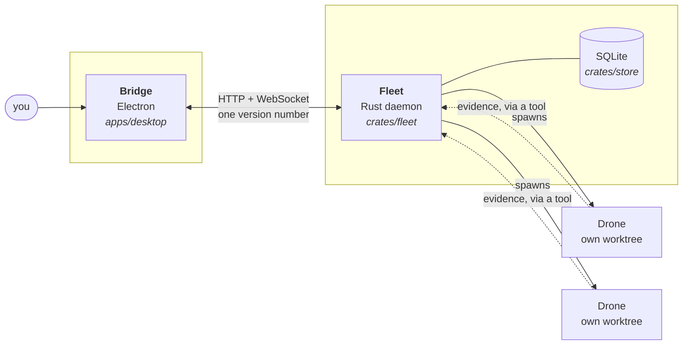
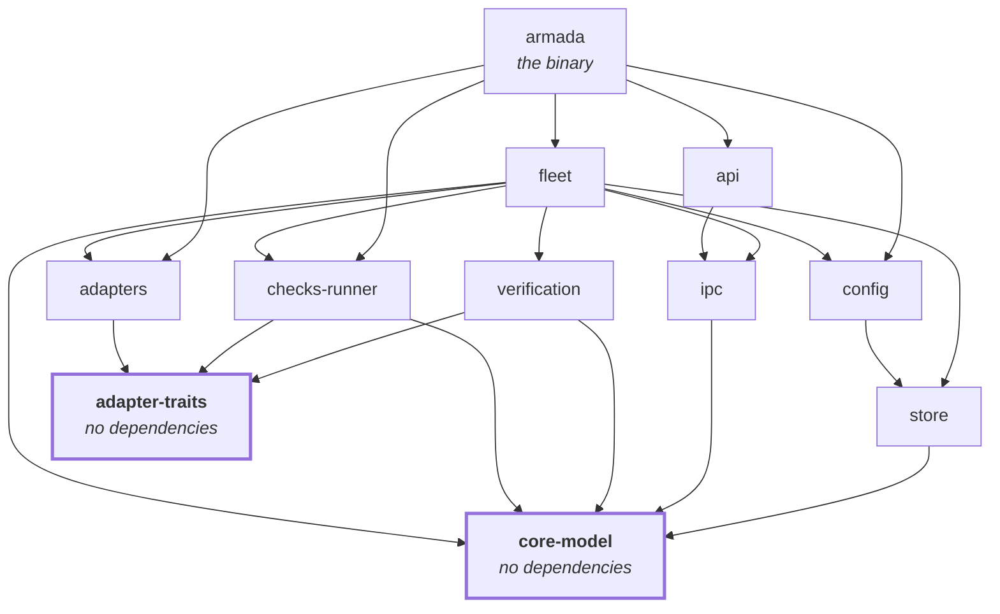
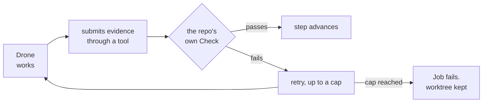

# Architecture

A map of the repository, for somebody who has just cloned it. It says where
things are and which rules hold everywhere; it does not restate the design.
`docs/contracts/system-architecture.md` is the authority on the topology, the
trust boundaries and the component taxonomy — this file points you into it.

**Nothing here runs yet.** See the status section of the README.

## Two processes, one seam

Bridge is the only way in, and it holds one connection — **it never talks to a
Drone.** A Drone never talks to anything except the tools Fleet handed it.

The seam between Bridge and Fleet is the only place Rust stops and TypeScript
starts. Every other boundary in this repository is a function call or a file.
`protocol-version.toml` holds the major and the minor both sides check; when
the majors disagree, four routes stay up so you can still see what is running
and stop it.
`docs/practices/protocol.md` is the detail.

## Where things are

| Path | Holds |
|---|---|
| `crates/` | The Rust workspace — the domain, the daemon, the adapters |
| `apps/desktop/` | Bridge. Three builds from one config: main, preload, renderer |
| `packages/` | What more than one surface reads — `tokens`, `icons` |
| `xtask/` | The gate. No dependencies, runs on a checkout with nothing built |
| `docs/contracts/` | Binding rules. Indexed by `docs/INDEX.md`, which the gate enforces |
| `docs/practices/` | How to write Rust, Bridge, and the seam between them |
| `docs/spikes/` | What was measured, with the raw transcript beside each |
| `docs/OPEN.md` | Every open question, generated by a walk over the documents |

## The crate graph

Direction is dependency. The two crates at the bottom have none, on purpose.

**The binary's three edges past `fleet` are the three verbs that need no
daemon.** `armada check` and `armada run` resolve a name against `config`'s
Manifest and execute it through `checks-runner`; `armada clean` gives a
worktree and its branch back through `adapters`. Only `armada serve` needs
`fleet` and `api`.

**`core-model` and `adapter-traits` pull no runtime and no I/O** — no `tokio`,
no `git2`, no `reqwest`. Every crate depends on those two, so anything they
pull becomes everyone's problem, and a trait that needs a runtime to *declare*
has already chosen the implementation's runtime for it.

`adapters` is the only crate permitted to know whose API it is talking to. A
vendor's name anywhere else is the boundary having leaked, and the gate says so.

## How a step advances

The rule the whole system exists for: **an agent does not decide it is
finished.**

Saying "done" in prose does nothing — the evidence goes through a tool Armada
gave the Drone, a mechanical check runs in that Job's worktree, and Fleet reads
the exit code. A Drone cannot push, because the version-control seam it is
handed has no push method: the call does not exist, rather than being refused.

## Rules that hold everywhere

Each is enforced by `cargo xtask verify-foundations`, not by remembering.

- `serde_json::from_*` appears only in `store` and `ipc` — the two places bytes
  enter the process. Everywhere else a value arrives typed.
- No vendor literal outside `adapters`.
- No design value outside the token set, anywhere under `apps/` or `packages/`.
- No glyph that is not in `packages/icons/icons.toml`.
- Nothing names a person or a machine, and nothing links to a private workspace.
- 900 lines refuses a file, 500 asks.
- Every document is in an index, and every open question is collected.

**Read the delta against a pinned baseline, never the colour.** A rule whose
subject does not exist yet fails and names what is missing, so red is a
legitimate state and a milestone landing registry rows ahead of the code
satisfying them returns the gate to it. Green means the lines named so far are
cleared, not that the foundations are finished.

## Reading order

1. This file.
2. `docs/practices/` — the one covering what you are about to write.
3. `docs/contracts/system-architecture.md` — when you need the why rather than
   the where.
