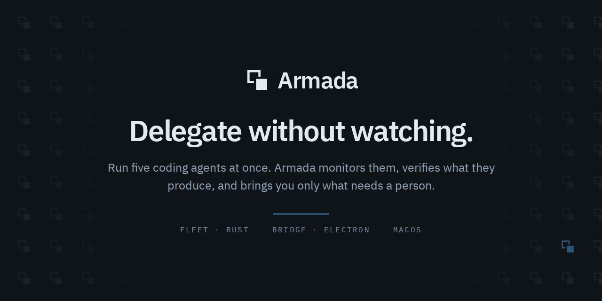

<p align="center">
  
</p>

<p align="center">
  <a href="#status"></a>
  <a href="LICENSE"></a>
  
  
</p>

---

## Status

**Armada is pre-alpha, and part of it runs.** There is one binary, `armada`:

| | |
|---|---|
| `armada serve [<path>]` | The daemon. Binds a loopback port, publishes a runtime file, serves the API and turns Jobs until it is signalled |
| `armada check <name>` | Runs one Check the repository's `armada.yml` declares, and first any Command its `requires` names — so `armada check format` reformats before it reads, exactly as the gate does |
| `armada run <name>` | Runs one Command it declares. Checks gate advancement; Commands do not |
| `armada clean [--all] [--force]` | Gives this repository's worktrees, branches and Jobs back, keeping any branch whose work is not merged |

What holds today, and how each is known:

| Claim | Evidence |
|---|---|
| A Job runs end to end — worktree, agent, Checks, commit, rebase, push, pull request | Several have. One document here was written that way |
| A Judge can refuse a step whose Checks all passed | It reads the step's work against the step's criteria |
| Evidence that guts a Check is caught — a deleted test, an added skip, a resolved-through config | The common patterns, mechanically, with no model call |
| A step editing outside what it declared is caught | The same way |
| An agent that loops without converging is stopped | Told to report first, then stopped |
| The machinery is proved | The acceptance test, hermetic — no process, no repository, no network |
| The merge is proved | A real agent fixed a real defect here, and the commit is in the history |

**Any refusal stops the Job at the step it happened on**, so you redirect that
step or restart it rather than starting over.

[Running it locally](#running-it-locally) is how to start. Watch the
[milestones](https://github.com/users/NickMele/projects/3/views/11) for what is next.

## What it is

You can run several coding agents at once today. What you cannot do is stop
watching them.

Armada is a macOS application that dispatches coding agents against git
repositories and **verifies their work before advancing them**. An agent does
not decide it is finished: it submits evidence through a tool Armada gave it,
Armada runs the repository's own checks against the result, and only then does
the work move on. Saying "done" in prose does nothing.

The problem it exists for is not throughput. It is that delegating work to
something that reports on itself means reading everything anyway.

**Three rules it is built around:**

- **An agent cannot mark its own work complete.** Evidence goes through a tool,
  a mechanical check decides, and a Judge can refuse a step whose checks passed.
- **An agent cannot reach the network.** Every Job works in its own git worktree
  on its own branch, in an environment built from nothing that carries no
  credential. Armada pushes on its behalf once the checks pass, and opens a
  pull request for a person to merge.
- **An agent inherits no MCP server.** Without that rule a spawned agent comes
  up holding every server the operator has connected — measured at seven
  servers, ninety-five tools, personal accounts — which is the defect that made
  the first attempt unusable.

**This is not a sandbox.** An agent can still run a shell, because a tool
allowlist is a permission list and not a toolset. What bounds it is the worktree
and the empty environment; real confinement means containers, and that is a
different system. `docs/scope.md` carries the reasoning.

## How it is put together

Two processes that ship as a pair and version together.

| | | |
|---|---|---|
| **Fleet** | Rust daemon | Owns Jobs, spawns and supervises agents, runs checks, writes the record. Runs detached — quitting the app does not kill work in flight |
| **Bridge** | Electron app | The only way in. Holds one connection to Fleet and never talks to an agent directly |

They meet at exactly one seam: a versioned protocol over HTTP and a WebSocket.
Every other boundary in the system is a function call or a file.

```
armada/
├── crates/          the Rust workspace — Fleet, the domain, the adapters
├── apps/desktop/    Bridge
├── packages/        shared: design tokens, icons, and what surfaces both read
├── xtask/           the build gate
└── docs/            contracts, practices, spikes, and what v1 taught
```

**[`ARCHITECTURE.md`](ARCHITECTURE.md) is the map** — the process topology, the
crate graph, and the rules that hold everywhere, with diagrams.

## Building it

**Requirements:** macOS, Rust 1.90 or later, and Node 24 — the version in
`.nvmrc`, which `pnpm` refuses to run without.

```sh
git clone https://github.com/NickMele/armada.git
cd armada
cargo xtask verify-foundations   # read what each line names, not the exit code
pnpm install
```

**A gate that reports red is not a broken checkout.** A rule whose subject does
not exist yet fails and names it, so the gate goes red whenever a milestone
lands its registry rows ahead of the code satisfying them. The tests pass either
way.

### The gate

Armada checks itself with a task rather than a CI config, so the same command
runs on a laptop and in CI. It has no dependencies and needs nothing built.

| Command | Checks |
|---|---|
| `cargo xtask verify-foundations` | Every foundation rule. Red is a legitimate state |
| `cargo xtask verify-tokens` | Design token outputs match the CSS they are generated from |
| `cargo xtask verify-docs` | Open questions are collected, and every citation resolves |
| `cargo xtask verify-roadmap` | Capabilities and their issues agree. Needs `gh` and a network, so not part of the gate |

Some of what the gate refuses:

- Untyped JSON outside the two crates allowed to parse it
- A vendor's name outside the adapter layer, or a design value that is not a token
- A file over 900 lines
- A component stylesheet nothing imports — Storybook draws it, the app draws it unstyled
- A domain registry row that disagrees with the machine it describes
- A tool a Drone is offered and not allowed to call
- A generated file that has drifted from the registry it came from
- Anything that names a person or a machine

### Tests

```sh
cargo nextest run --workspace --exclude acceptance   # not `cargo test`
cargo test -p acceptance                             # the milestone's own claim
pnpm bridge-test                                     # the TypeScript half
```

**`pnpm bridge-test` needs a browser.** It runs the pure modules under
`packages/screens` in node, then mounts every story in `packages/components` in
headless Chromium — a story that throws is a failure, and a story with a `play`
function has its assertions run against what it drew.

`pnpm install` does not fetch that browser. `armada run browsers` does, once per
machine. Without it the second suite fails naming an executable that is not
there, which is a missing browser and not a failing component.

Watch one while you work on it, from `packages/components` or
`packages/screens`: `pnpm exec vitest`.

## Running it locally

```sh
pnpm dev
```

That is the whole loop: it stops the running Fleet, reinstalls `armada` from the
working tree, starts Fleet, waits for it to publish, and starts Bridge in the
foreground. Ctrl-C stops both, which is a convenience of the script and not how
Armada behaves in earnest.

Or by hand, which is only the same two halves in the right order:

```sh
cargo install --path crates/armada --debug   # armada, on your PATH
armada serve .                               # runs until Ctrl-C
pnpm --filter @armada/desktop dev            # in another terminal
```

**Fleet first, always.** Fleet binds a port and publishes a runtime file, and
Bridge reads that file to find where to connect.

**[`docs/practices/running-locally.md`](docs/practices/running-locally.md) is
the rest** — what a healthy start prints, what Fleet refuses before it binds a
port, how the two halves handle version skew, what a finished Job leaves behind,
and what `armada clean` will and will not delete.

## Roadmap

Work is tracked as GitHub issues, grouped two ways.

- **[Milestones](https://github.com/NickMele/armada/milestones)** — each one
  carries a claim that is either true or not. *M1 — Dogfood* is "Armada does a
  small real task in the Armada repo, and I merge the branch it wrote."
- **[Capabilities](https://github.com/NickMele/armada/labels/capability)** —
  what the system can do, written from the outside. A capability names the steps
  that make it real, so its progress is computed rather than reported.

## Contributing

Not yet — see [`CONTRIBUTING.md`](CONTRIBUTING.md). Issues and questions are
welcome; there is nothing to review.

Security: [`SECURITY.md`](SECURITY.md). Armada brokers credentials and runs
commands a repository declares, so the interesting constraints are listed there.

## Prior art, and a deleted first attempt

This repository is the second attempt. There was a v1 that worked well enough to
be used and badly enough to be replaced, and it was deleted rather than
refactored.

What it taught is written down in
[`docs/v1-learnings/`](docs/v1-learnings/) — including the things that went
wrong, which is most of it. Its history is on the `v1-archive` branch and the
`v1-final` tag; a bare file path in a document means `git show v1-final:<path>`.

## License

[Apache 2.0](LICENSE).
