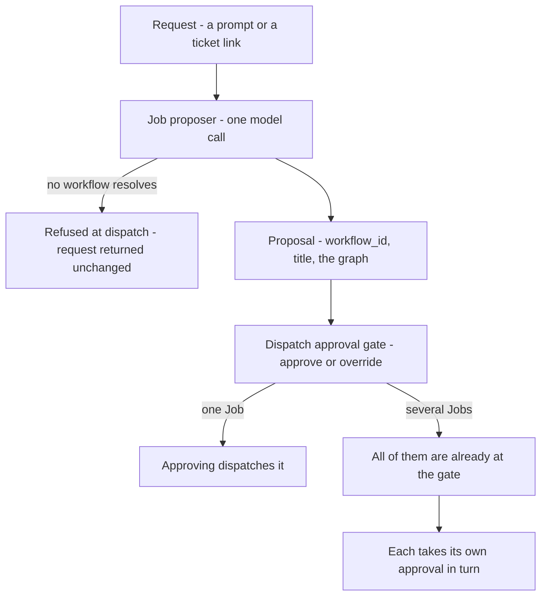

# Job proposer

**What it is:** The model call that reads a dispatch request — a prompt, a ticket link — and proposes a Job: which workflow it should run, what to call it, and where the work is several Jobs, the order between them. Proposes only; a person approves at the dispatch gate.

---

**Kind:** Policy.

Formalises the Job proposer. Its rules previously lived across [Convoy](convoy.md), [Manifest](manifest.md), [Workflow](workflow.md), [Fleet](fleet.md), [Job](job.md) and [Job Board](job-board.md); this document is their home and those pages link here.

**A Policy gets a document when it needs a name and a single owner, not an ID** — the same reason [Judge](judge.md) has one while being a Policy rather than a domain object.

## What it is

One model call on the dispatch path. It reads the request a person dispatched — a prompt, or a link to a ticket — and **proposes a Job**.

**It is a Policy rather than an Agent** — no toolset, no worktree, no session, no ability to transition anything. See `../contracts/system-architecture.md`. [Fleet](fleet.md) makes the call, reads the proposal and puts it in front of a person.

**It is a cheap model call with a bounded question, and a proposal a person approves or overrides.** It is not a session, an agent or a [Drone](drone.md); it is not a decision, and it dispatches nothing and transitions nothing.

**It is called the Job proposer, always.** The classifier, the Job-shape classifier and the shape classifier are retired — see `../contracts/design-system.md` lexicon.

## Why it exists

**So that dispatching is describing the work, not filling in a form.** A request arrives as a prompt or a ticket link. Someone has to decide what kind of work it is, which workflow fits, and whether it is one Job or several.

Doing that by hand means knowing the workflow catalogue before you can ask for anything. Hand entry stays available and is the **override**, not the path.

## What it proposes

| Output | Detail |
| --- | --- |
| `title` | What the Job is called, written from the description or the prompt |
| `workflow_id` | Which WorkflowDef the work should run under |
| A graph, where the work is several Jobs | The order they must land in |

**Naming the Job is part of the same reading**, so nobody types a title for work they have already described — the call has the description in front of it and a [Job](job.md) requires a name.

[Workflow](workflow.md) owns the workflow catalogue. The resolved definition is frozen into the Job at creation, so the proposer chooses which one and the freeze is what stops it moving afterwards. A graph is proposed in one pass, and each member waits on the one before it reaching `completed_success`.

**One call, because it is one reading.** Which workflow, what to call it and whether it is one Job or several answer the same question — *what is this work* — off the same input.

### Scope is not among them

**It proposes no `write_targets` and no `atomic`.** Which files the work touches belongs to the workflow's own scope step, declared through the scope tool by a [Drone](drone.md) that has read the code.

Why: naming paths credibly needs the repository, and a guess would be a second source for something settled later with better information.

**Shape is therefore not among them either.** A Job's shape follows from `write_targets` and `atomic`, so it is underivable until the scope step runs. [Convoy](convoy.md) — Three shapes, not two carries what the three are.

### When it cannot resolve a workflow

**The request is refused at dispatch and returned unchanged.** No workflow is assigned by default. What the person gets back is the request they wrote, to retry or to hand-enter.

Why: the resolved definition is frozen into the Job at creation and becomes the yardstick the work is judged against, so a default would not be a guess the person could correct later — it would be the standard the Drone is held to.

## What it reads

| Given | Detail |
| --- | --- |
| The request | Verbatim. Fleet opens no link and fetches nothing |
| The workflows this Manifest holds | Each one's id, name and step labels |

**It is given nothing else.** Not the repository, not the `armada.yml`, not the Board, not the Jobs already running.

Why: every extra token is money on a call that fires on every dispatch, and a call that can reach the repository is a [Drone](drone.md) under another name.

**Step labels are how one workflow is told from another.** A name alone separates Bug from Revert and does not separate Feature from Refactor.

## It runs on every dispatch

**One dispatch path, not two.** The call runs whether the repository holds one Workspace or several, so there is no case in which a person types the workflow instead of approving one.

Skipping it where the answer looks obvious would cost the Job its entry zero, which is what a revert inherits and a rescope recomputes against.

**Cost accepted:** a cheap model call, its latency and its budget, on every dispatch.

## Where the proposal is approved

| Step | What happens |
| --- | --- |
| 1 | A person opens Dispatch a Job |
| 2 | They describe the work — typed, or a link to a ticket or a Notion document |
| 3 | They dispatch. The proposer reads the request and every Job it became is created |
| 4 | The proposal is visible filling in as it is worked out |
| 5 | The person approves. That is what starts the work |

At step 3 the proposer works out what kind of work it is and which workflow it runs under. At step 4 the proposal fills in progressively rather than appearing complete at the end.

**Every Job exists before any of them is approved.** Step 3 creates each at `awaiting_approval` and step 5 dispatches the one it is pressed on — see [Job Board](job-board.md), Job status on the Board.

**Approving a Job dispatches that Job, and it is the only approval act on this path.**
Why: every Job the request became already stands at `awaiting_approval`, so a plan-level act would have nothing left to create.

| What was proposed | What step 5 dispatches | What is left at the gate |
| --- | --- | --- |
| One Job | That Job. The ordinary case | Nothing |
| Several Jobs | The one it was pressed on | The rest, each awaiting its own turn |

[Fleet](fleet.md) holds the order at admission rather than reading it off the order approvals arrive in, so the strictly-one-by-one rule and the no-batch-approve rule both hold.

**It is the dispatch gate, not a gate of its own.** A proposal is approved where a mid-flight scope revision is approved, so the things called approval on a Job's path stay two — this gate, and a workflow's own human gate over finished work.

**Cost accepted:** two taps for a Job whose proposal is obvious, mitigated by such a proposal being trivially acceptable.

**Beyond the progressive fill, the surface is not drawn.** Dispatch a Job is design order 1 and everything else reuses its approval pattern.

## What is recorded

**Its output is not stored as its own record.** `workflow_id` and `title` land on the [Job](job.md), and no field says a proposal happened.

**Its reasoning is.** Entry zero of a Job's `scope_revisions[]` carries a `rationale` — why that workflow. It names no paths, because none were proposed; the scope step's own declaration is the entry that names them. That rationale is the only durable trace the call ever ran.

| Depends on it | What it reads | Why |
| --- | --- | --- |
| A revert | Its `subject`'s scope revisions (see Open questions) | It reads rather than proposing afresh, so it cannot reach a different shape |
| A rescope | The previous entry | It recomputes against what was there rather than from scratch |
| A human override | `approved_by` | `human` on entry zero, never `fleet`, which makes the call evaluable |

A human override is evaluable against the decisions people actually made.

## Scope is the workflow's first step, not the proposer's

**A Job reaches the dispatch gate with `write_targets` null.** Null is scope not yet determined; empty would claim the Job writes nothing.

**What the gate approves is the workflow, the name and the split.** Approving says this is a Bug and it is one Job. It does not say which files.

**Proposing scope at dispatch is rejected.** A call that has not read the repository can only guess at paths, and one that has read it is a [Drone](drone.md) at many times the price.

The scope step declares its paths through the scope tool, and the drift check compares that declaration against the real diff. A proposal made before anything was read is not something that check can weigh.

**Rescope-and-respawn stays the correction path** for a person changing a dispatched Job's scope, and that returns to this same gate. **A Drone asking for a path the Job does not name does not**: a [Judge](judge.md) answers whether it belongs to the step the Drone was given, and the Job never leaves `running`. See [Change a Job's scope](../journeys/change-a-jobs-scope.md).

## Relationship to Helm

[Helm](helm.md) does the same reasoning more deliberately — the expensive end of a spectrum this covers cheaply by default.

|  | Job proposer | Helm |
| --- | --- | --- |
| Runs | On every dispatch | On request |
| Budget | Tight | None |
| Model | Supplied by the caller | Supplied by the caller |

**They share a prompt library and an output schema, not an implementation.**

It shares the `ModelClient` adapter with the [Judge](judge.md) — same client, different callers, model as a parameter.

## Open questions

- **[revert-inherits-which-scope-revision]** Which of a Job's scope revisions a revert reads from the Job it undoes. What decides it: entry zero carries the proposer's rationale and no paths, so a revert reading entry zero inherits no scope at all. The two candidates are the scope step's own entry, which is the first that names paths, and the latest entry, which is what the Job actually ran under. They differ only on a Job that was rescoped mid-flight. The property this has to preserve is that a revert cannot arrive at a different shape from the Job it reverses, and that holds for either candidate as long as a revert reads rather than proposing afresh.
