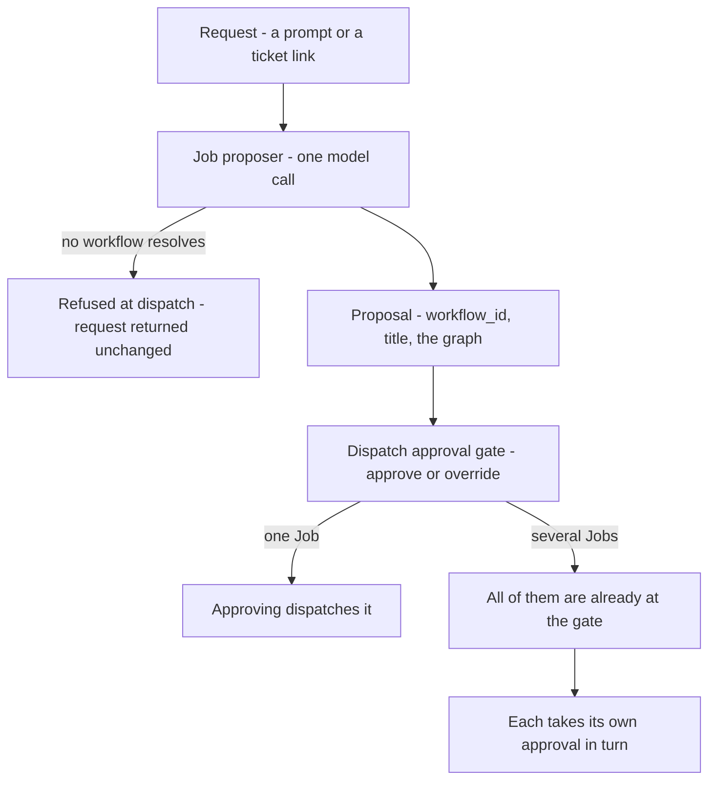

# Job proposer

**What it is:** The model call that reads a dispatch request — a prompt, a ticket link — and proposes a Job: which workflow it should run, what to call it, and where the work is several Jobs, the order between them. Proposes only; a person approves at the dispatch gate.

---

**Kind:** Policy.

Formalises the Job proposer. Its rules previously lived across [Convoy](convoy.md), [Manifest](manifest.md), [Workflow](workflow.md), [Fleet](fleet.md), [Job](job.md) and [Job Board](job-board.md); this document is their home and those pages link here.

**A Policy gets a document when it needs a name and a single owner, not an ID** — the same reason [Judge](judge.md) has one while being a Policy rather than a domain object.

## What it is

One model call on the dispatch path. It reads the request a person dispatched — a prompt, or a link to a ticket — and **proposes a Job**.

**It is a Policy rather than an Agent** — no toolset, no worktree, no session, no ability to transition anything. See `../contracts/system-architecture.md`. [Fleet](fleet.md) makes the call, reads the proposal and puts it in front of a person.

**It is a cheap model call with a bounded question, and a proposal a person approves or overrides.** It is not a session, an agent or a [Drone](drone.md); it is not a decision, and it dispatches nothing and transitions nothing.

**It is called the Job proposer, always.** The classifier, the Job-shape classifier and the shape classifier are retired — see `../contracts/design-system.md` lexicon.

## Why it exists

**So that dispatching is describing the work, not filling in a form.** A request arrives as a prompt or a ticket link. Someone has to decide what kind of work it is, which workflow fits, and whether it is one Job or several.

Doing that by hand means knowing the workflow catalogue before you can ask for anything. Hand entry stays available and is the **override**, not the path.

## What it proposes

| Output | Detail |
| --- | --- |
| `title` | What the Job is called, written from the description or the prompt |
| `workflow_id` | Which WorkflowDef the work should run under |
| A graph, where the work is several Jobs | The order they must land in |
| `scope`, where the work is several Jobs | What each one is for, and none of what the others are |

**Naming the Job is part of the same reading**, so nobody types a title for work they have already described — the call has the description in front of it and a [Job](job.md) requires a name.

### A Job is briefed on its own part

**One Job's `facts` is the request as the person wrote it.** Nothing was divided, so its part is all of it.

**A member of a split gets its `scope` line and nothing else.** Not the rest of the request, and not the other Jobs' titles. What that line says is the whole of what its [Drone](drone.md) is told, which is why a plan of several whose member names no part is refused rather than handed the undivided request.

Why: a request naming a bug and an addition became two Jobs on 9 Sep 2026, and the first one did both. Every member carried the whole request, so the split lived in the two titles and nowhere a Drone reads — and the second Job was queued to redo work that had already landed.

What it costs is real and is the same cost in every direction: a Drone on a split no longer reads the sentences that were another Job's, including the body of any link the request named. The proposer read them, and writing each part is what it read them for.

[Workflow](workflow.md) owns the workflow catalogue. The resolved definition is frozen into the Job at creation, so the proposer chooses which one and the freeze is what stops it moving afterwards. A graph is proposed in one pass, and each member waits on the one before it reaching `completed_success`.

**One call, because it is one reading.** Which workflow, what to call it and whether it is one Job or several answer the same question — *what is this work* — off the same input.

### Scope is not among them

**It proposes no `write_targets` and no `atomic`.** A Job it drafted reaches the gate with the first null and the second false.

Why: naming paths credibly needs the repository, and a guess would be a second source for something a [Drone](drone.md) states later with better information.

**The workflow's scope step does not fill them in either.** `declare_scope` sets that step's own `DeclaredPaths`, which is what the drift check reads; `write_targets` moves only on a scope revision, and `atomic` is frozen at dispatch. [Change a Job's scope](../journeys/change-a-jobs-scope.md) holds what each of the two lists is for.

**Shape is therefore not among them either.** A Job's shape follows from `write_targets` and `atomic`, and this call settles neither. [Convoy](convoy.md) — Three shapes, not two carries what the three are.

### A sibling may land the work first

**Two Jobs from one reading are unordered by construction.** A split is not a sequence, so the proposer writes no edge between them and [Fleet](fleet.md) never weighs one against the other — either may reach a Drone first, and either may land work the other was also asked for.

On 9 Sep 2026 one did. A request naming a bug and an addition became two Jobs; the first landed both and merged; the second was dispatched ninety seconds later into a base that already held its work. Its Drone found nothing to write and said so, and the [Judge](judge.md) — which reads the diff and never the transcript — refused it for not implementing a feature that was by then on `main`.

**So Fleet reads once before dispatching a queued Job whose sibling has landed.** It is shown that Job's brief and what the landed sibling's own Evidence claimed, and it answers whether anything asked for is still left to do. A Job with nothing left reaches `superseded` — *the work landed outside the Job; the record has nothing left to say* — and never takes a slot.

**The reading is Fleet's own and a Drone may not supply it.** `crates/fleet/src/gate.rs` holds the rule and why: a Drone reporting that its own work is unnecessary is prose, and reading prose catches an honest Drone and believes a dishonest one. This asks before a Drone exists, which is the only place the question can be answered by something with nothing at stake.

**Every failure runs the Job.** An unreadable answer, a call that could not be made, a sibling that submitted no evidence — each answers *needed*. Of the two answers only *supersede it* cannot be taken back: a Job wrongly run repeats work and is caught at review; a Job wrongly superseded is work nobody notices is missing.

`proposal_id` is what makes a sibling findable, and it is the only thing on the record that says two Jobs are the same request.

### When it cannot resolve a workflow

**The request is refused at dispatch and returned unchanged.** No workflow is assigned by default. What the person gets back is the request they wrote, to retry or to hand-enter.

Why: the resolved definition is frozen into the Job at creation and becomes the yardstick the work is judged against, so a default would not be a guess the person could correct later — it would be the standard the Drone is held to.

## What it reads

| Given | Detail |
| --- | --- |
| The request | Verbatim. Fleet opens no link and fetches nothing |
| The workflows this Manifest holds | Each one's id, name and step labels |

**It is given nothing else.** Not the repository, not the `armada.yml`, not the Board, not the Jobs already running.

Why: every extra token is money on a call that fires on every dispatch, and a call that can reach the repository is a [Drone](drone.md) under another name.

**Step labels are how one workflow is told from another.** A name alone separates Bug from Revert and does not separate Feature from Refactor.

## It runs on every dispatch

**One dispatch path, not two.** The call runs whether the repository holds one Workspace or several, so there is no case in which a person types the workflow instead of approving one.

Skipping it where the answer looks obvious would cost the Job its entry zero, which is what a revert inherits and a rescope recomputes against.

**Cost accepted:** a cheap model call, its latency and its budget, on every dispatch.

## Where the proposal is approved

| Step | What happens |
| --- | --- |
| 1 | A person opens Dispatch a Job |
| 2 | They describe the work — typed, or a link to a ticket or a Notion document |
| 3 | They dispatch. The proposer reads the request and every Job it became is created |
| 4 | The wait says what the call is doing, and offers the stop |
| 5 | The person approves. That is what starts the work |

At step 3 the proposer works out what kind of work it is and which workflow it runs under.

**Step 4 draws the call, not a partial proposal.** This page asked for the proposal to fill in progressively; what shipped is one request and one response, so the Jobs arrive whole, once, at the end. What moves during the wait is the call's own progress — how far it has reached, how long it has been out against Fleet's budget, which model is reading it — and past a mark the surface says so and offers the stop. A skeleton of Job rows would claim rows are arriving one at a time, which is not what happens. Corrected 2026-09-08, against the built surface.

**Every Job exists before any of them is approved.** Step 3 creates each at `awaiting_approval` and step 5 dispatches the one it is pressed on — see [Job Board](job-board.md), Job status on the Board.

**Approving a Job dispatches that Job, and it is the only approval act on this path.**
Why: every Job the request became already stands at `awaiting_approval`, so a plan-level act would have nothing left to create.

**Step 5 happens on the proposal, not on Job detail.** The head of the proposal carries its own approval control, beside the Review that opens it. Everything the gate approves — the workflow, the name and the split — is already on the screen the proposal is drawn on, so sending a person to detail to say yes to what they are reading is a second surface for no second fact. Settled 2026-09-08, from the owner's own complaint: *"I would love if I didn't need to click Review just to get to the approval button."*

**Only the head of a proposal is approvable, and Review is still there.** A chained Job is not at its gate until the one before it completes, so the rows under the first offer no approval. Review opens any of them, for the case where the title is not enough to decide on.

| What was proposed | What step 5 dispatches | What is left at the gate |
| --- | --- | --- |
| One Job | That Job. The ordinary case | Nothing |
| Several Jobs | The one it was pressed on | The rest, each awaiting its own turn |

[Fleet](fleet.md) holds the order at admission rather than reading it off the order approvals arrive in, so the strictly-one-by-one rule and the no-batch-approve rule both hold.

**It is the dispatch gate, not a gate of its own.** A proposal is approved where a mid-flight scope revision is approved, so the things called approval on a Job's path stay two — this gate, and a workflow's own human gate over finished work.

**Cost accepted:** one tap for a Job whose proposal is obvious — the approval sits on the proposal, so nobody opens a Job in order to agree with what is already on screen. What is given up is that the reading and the release are one gesture apart rather than two; the [Job Board](job-board.md) keeps the stricter arrangement, because there the proposal is not on screen.

**The surface is drawn.** It is `DispatchRequest` in `packages/components`, whose own note carries what it decided and why; Dispatch a Job is design order 1 and everything else reuses its approval pattern.

## What is recorded

**Its output is not stored as its own record.** `workflow_id`, `title` and the Job's own brief land on the [Job](job.md) — the last as `facts` — and no field says a proposal happened.

**Its reasoning is.** Entry zero of a Job's `scope_revisions[]` carries a `rationale` — why that workflow. It names no paths, because none were proposed; the scope step's own declaration is the entry that names them. That rationale is the only durable trace the call ever ran.

| Depends on it | What it reads | Why |
| --- | --- | --- |
| A revert | Its `subject`'s scope revisions (see Open questions) | It reads rather than proposing afresh, so it cannot reach a different shape |
| A rescope | The previous entry | It recomputes against what was there rather than from scratch |
| A human override | `approved_by` | `human` on entry zero, never `fleet`, which makes the call evaluable |

A human override is evaluable against the decisions people actually made.

## Scope is the workflow's first step, not the proposer's

**A Job reaches the dispatch gate with `write_targets` null.** Null is scope not yet determined; empty would claim the Job writes nothing.

**What the gate approves is the workflow, the name and the split.** Approving says this is a Bug and it is one Job. It does not say which files.

**Proposing scope at dispatch is rejected.** A call that has not read the repository can only guess at paths, and one that has read it is a [Drone](drone.md) at many times the price.

The scope step declares its paths through the scope tool, and the drift check compares that declaration against the real diff. A proposal made before anything was read is not something that check can weigh.

**Rescope-and-respawn stays the correction path** for a person changing a dispatched Job's scope, and that returns to this same gate. **A Drone asking for a path the Job does not name does not**: a [Judge](judge.md) answers whether it belongs to the step the Drone was given, and the Job never leaves `running`. See [Change a Job's scope](../journeys/change-a-jobs-scope.md).

## Relationship to Helm

[Helm](helm.md) does the same reasoning more deliberately — the expensive end of a spectrum this covers cheaply by default.

|  | Job proposer | Helm |
| --- | --- | --- |
| Runs | On every dispatch | On request |
| Budget | Tight | None |
| Model | Supplied by the caller | Supplied by the caller |

**They share a prompt library and an output schema, not an implementation.**

It shares the `ModelClient` adapter with the [Judge](judge.md) — same client, different callers, model as a parameter.

## Open questions

- **[revert-inherits-which-scope-revision]** Which of a Job's scope revisions a revert reads from the Job it undoes. What decides it: entry zero carries the proposer's rationale and no paths, so a revert reading entry zero inherits no scope at all. The two candidates are the scope step's own entry, which is the first that names paths, and the latest entry, which is what the Job actually ran under. They differ only on a Job that was rescoped mid-flight. The property this has to preserve is that a revert cannot arrive at a different shape from the Job it reverses, and that holds for either candidate as long as a revert reads rather than proposing afresh.
