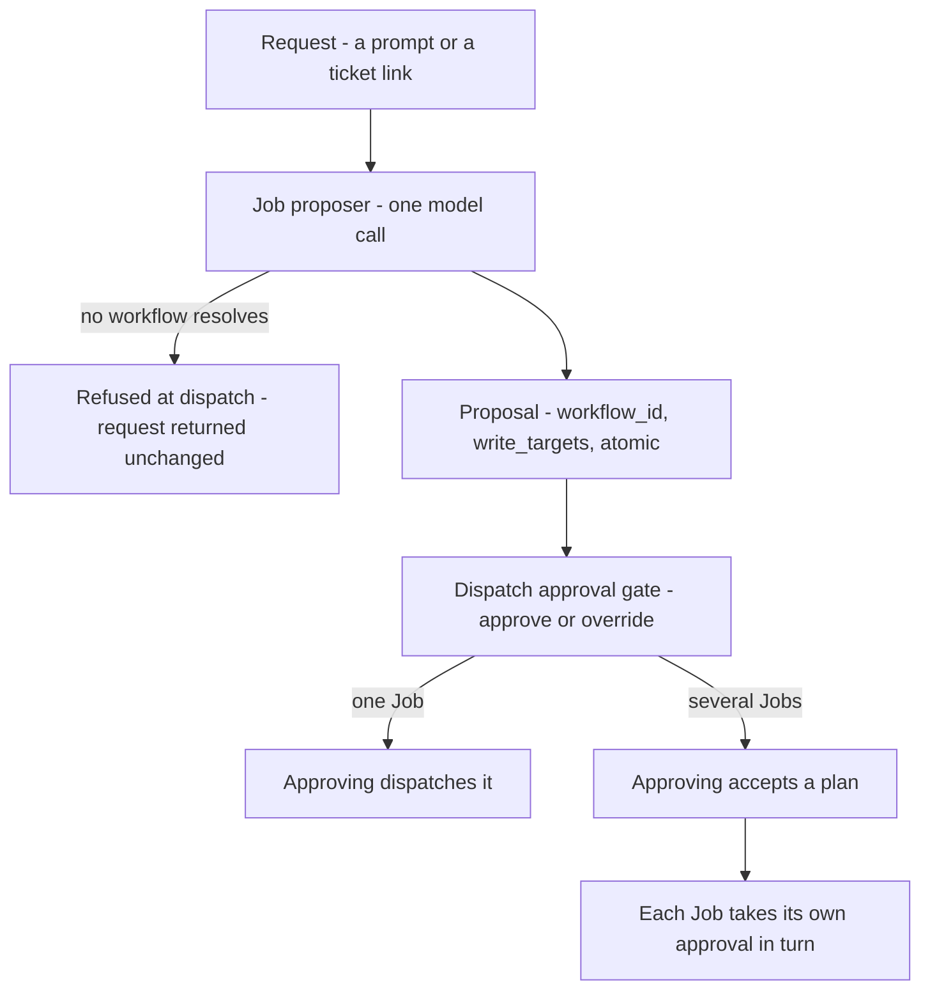

# Job proposer

**What it is:** The model call that reads a dispatch request — a prompt, a ticket link — and proposes a Job: which workflow it should run, where it will write, whether those targets must land together, and where the work is several Jobs, the graph between them. Proposes only; a person approves at the dispatch gate.

---

**Kind:** Policy.

Formalises the Job proposer. Its rules previously lived in a section of [Convoy](convoy.md) and a paragraph of [Manifest](manifest.md), each stating overlapping halves, with the rest scattered across [Workflow](workflow.md), [Fleet](fleet.md), [Job](job.md) and [Job Board](job-board.md). This document is their home; those pages link here. Same reason [Judge](judge.md) has a document while being a Policy rather than a domain object — it needed a name and a single owner, not an ID.

## What it is

One model call on the dispatch path. It reads the request a person dispatched — a prompt, or a link to a ticket — and **proposes a Job**. It has no toolset, no worktree, no session and no ability to transition anything, which is why it is a Policy rather than an Agent (see `../contracts/system-architecture.md`): [Fleet](fleet.md) makes the call, reads the proposal and puts it in front of a person.

| The Job proposer is | The Job proposer is not |
| --- | --- |
| A cheap model call with a bounded question | A session, an agent, or a [Drone](drone.md) |
| A proposal a person approves or overrides | A decision. It dispatches nothing and transitions nothing |
| Called the Job proposer, always | The classifier, the Job-shape classifier, the shape classifier — retired, see `../contracts/design-system.md` lexicon |

## Why it exists

**So that dispatching is describing the work, not filling in a form.** A request arrives as a prompt or a ticket link. Someone has to decide what kind of work it is, which workflow fits, where it will write and whether those writes must land together. Doing that by hand means knowing the workflow catalogue and the Workspace graph before you can ask for anything.

Hand entry stays available and is the **override**, not the path.

## What it proposes

| Output | Detail |
| --- | --- |
| `workflow_id` | Which WorkflowDef the work should run under. [Workflow](workflow.md) owns the catalogue; the resolved definition is frozen into the Job at creation, so this chooses which one and the freeze is what stops it moving afterwards |
| `write_targets[]` | The paths the Job intends to write |
| `atomic` | Whether those targets must land as one unit |
| A graph, where the work is several Jobs | With `atomic` decided per group — a [Convoy](convoy.md) landing a coupled pair with a downstream Job consuming it, proposed in one pass |

**Shape is not among them.** A Job's shape follows from `write_targets` and `atomic` and is stored nowhere, so there is no shape value to choose and `origin` never needed one. [Convoy](convoy.md) — Three shapes, not two carries what the three are.

**One call rather than two, because it is one reading.** Choosing a workflow and stating scope answer the same question — *what is this work* — off the same input. Splitting them means reading the request twice, and means a person approving a workflow chosen against one understanding beside a scope chosen against another.

### When it cannot resolve a workflow

**The request is refused at dispatch and returned unchanged.** No workflow is assigned by default. The resolved definition is frozen into the Job at creation and becomes the yardstick the work is judged against, so a default would not be a guess the person could correct later — it would be the standard the Drone is held to. What the person gets back is the request they wrote, to retry or to hand-enter.

## What it reads

- **Scan-gathered dependency evidence** — workspace-protocol deps in package manifests, carried forward from Scan for exactly this purpose and never written into any `armada.yml`.
- **External dependency-graph tooling**, optionally, as an input signal.
- **A root-Manifest default-posture setting** as a per-repo prior. Defined on [Manifest](manifest.md) — Cross-Workspace Jobs, which owns the `armada.yml` field.

## It runs on every dispatch

| Repo | What the call still has to decide |
| --- | --- |
| Several Workspaces | The workflow, the paths, whether those paths must land together, and where the work is several Jobs, the graph between them |
| One Workspace | The paths. The owning Manifest, the gate list and `atomic` are all forced, so the shape question collapses — but `write_targets` holds paths, and a Job may touch one file or twelve |

**The same call, a narrower question.** Skipping it in the single-Workspace case would cost three things:

- The Job would have no entry zero — which is what a revert inherits and a rescope recomputes against.
- The write-scope overlap warning would have nothing real to compare.
- Or every Job would claim its whole Workspace, so the warning fires on every pair and is learned to be ignored.

**Cost accepted:** a cheap model call, its latency and its budget, on the dispatch path of the commonest kind of repo, bought with one dispatch path instead of two.

## Where the proposal is approved

| Step | What happens |
| --- | --- |
| 1 | A person opens Dispatch a Job |
| 2 | They describe the work — typed, or a link to a ticket or a Notion document |
| 3 | They dispatch. The Job proposer reads that request, works out what kind of work it is, what it will touch and which workflow it runs under, and a [Job](job.md) is created from it |
| 4 | The proposal is visible filling in as it is worked out, rather than appearing complete at the end |
| 5 | The person approves. That is what starts the work |

**The Job exists before it is approved.** Step 3 creates it at `awaiting_approval` and step 5 dispatches it — see [Job Board](job-board.md), Job status on the Board.

What step 5 does depends on how much was proposed.

| What was proposed | What approving it does |
| --- | --- |
| One Job | Dispatches it. The ordinary case, and the one the steps above describe |
| Several Jobs | Accepts a plan and starts nothing. Each Job still takes its own one-by-one dispatch approval when its turn comes, so [Fleet](fleet.md)'s strictly-one-by-one rule and the no-batch-approve rule both hold |

**It is the dispatch gate, not a gate of its own.** What the proposer emits is scope, and a mid-flight scope revision already returns to that same gate; the same decision passing through two different gates depending on when it is made would be arbitrary. This is also what holds the things called approval on a Job's path to two — this gate, and a workflow's own human gate over finished work.

**Cost accepted:** two taps for a single-Workspace Job whose proposal is obvious, mitigated by such a proposal being trivially acceptable.

**Beyond the progressive fill, the surface is not drawn.** Dispatch a Job is design order 1 and everything else reuses its approval pattern.

## What is recorded

**Its output is not stored as its own record.** `write_targets` and `atomic` land on the [Job](job.md); shape is derived from them; no field says a proposal happened.

**Its reasoning is.** Entry zero of a Job's `scope_revisions[]` is the Job proposer's initial statement of scope, carrying a `rationale` — the dependency evidence read and the posture prior applied. With shape derived rather than stored, that rationale is the only durable trace the call ever ran.

| Depends on it | What it reads | Why |
| --- | --- | --- |
| A revert | Entry zero of its `subject` | It reads rather than proposing afresh, so it cannot arrive at a different shape from the Job it reverses |
| A rescope | The previous entry | It recomputes against what was already there rather than from scratch |
| A human override | `approved_by` | It is not the Job proposer, which is what makes the call evaluable against the decisions people actually made |

## Scope is settled before dispatch, never after

The dispatch approval gate's whole content is scope, so a Job arriving there without it gives a person nothing to approve. Proposing after a discovery step was considered and rejected: it declines to guess rather than correcting a guess, which is a real difference, but it needs a second scope gate after that step — the arbitrary split that merging the gates removed. Rescope-and-respawn is the correction path, and it returns a widening to the same gate.

## Relationship to Helm

[Helm](helm.md) does the same reasoning more deliberately — the expensive end of a spectrum this covers cheaply by default.

|  | Job proposer | Helm |
| --- | --- | --- |
| Runs | On every dispatch | On request |
| Budget | Tight | None |
| Model | Supplied by the caller | Supplied by the caller |

**They share a prompt library and an output schema, not an implementation.**

It shares the `ModelClient` adapter with the [Judge](judge.md) — same client, different callers, model as a parameter.
