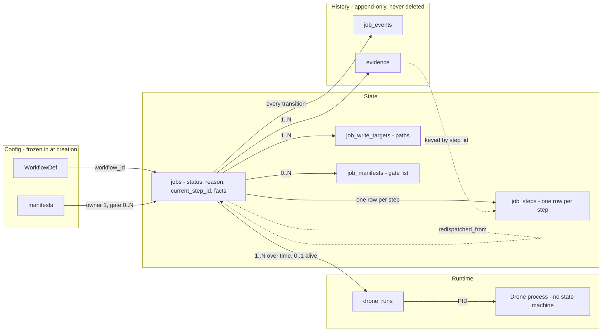
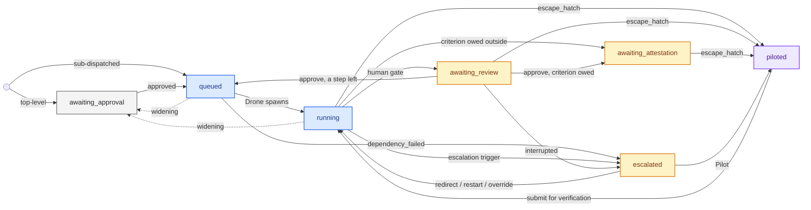
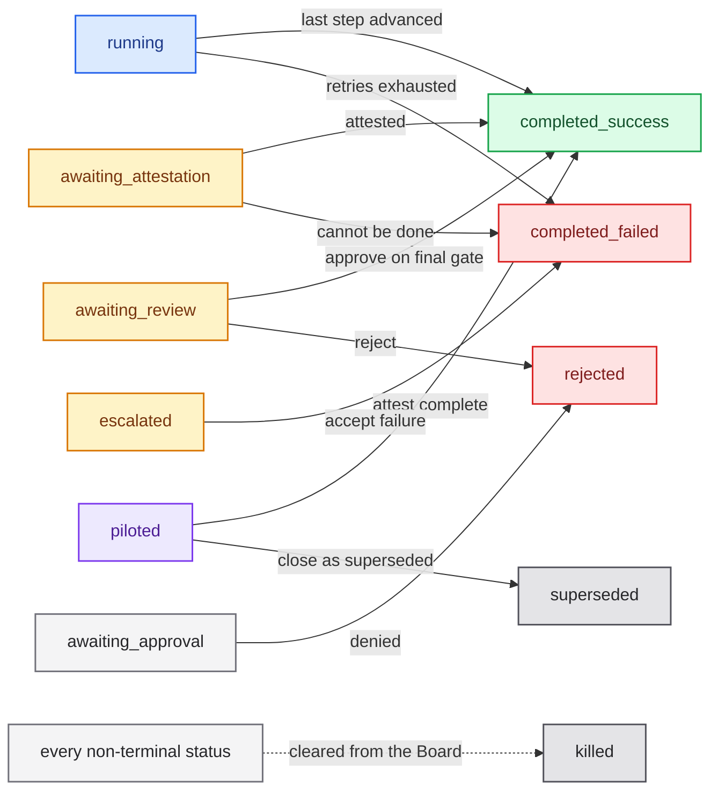

# Job

**What it is:** The unit of work Fleet dispatches to a Drone against a WorkflowDef. Data, not an actor: it records which workflow it follows, its status, its per-step state, its Facts and Evidence, and which Drone is on it. Only Fleet writes a transition.

---

**Kind:** Entity.

Formalizes Job — the unit of work Fleet dispatches to a Drone against a WorkflowDef. Companion to the main Armada brief and [Workflow](workflow.md).

## What it is

A Job is **data, not an actor**. It is the record of work to be accomplished — which WorkflowDef it follows, its current status, its accumulated Facts and Evidence, and which Drone (if any) is working it.

**[Fleet](fleet.md) is the only actor that drives transitions on a Job's state.** A Drone's self-report is an input signal, never authoritative — at both the Job-status level and the nested step level.

## Ownership split

Each entity's own document owns the rest.

| Entity | Role on a Job |
| --- | --- |
| WorkflowDef | The blueprint frozen into the Job at creation. Config, not state |
| Job | The record — holds both machines as data |
| Fleet | The engine — owns every transition on both machines |
| Drone | Executes, reports a signal. Transitions nothing |

WorkflowDef lives on [Workflow](workflow.md); the others on [Fleet](fleet.md) and [Drone](drone.md).

## What carries state

Configuration is frozen in at creation, state lives on the row and the rows beneath it, history accumulates and is never deleted, and the runtime hangs underneath because a process is not a record.

**Two machines sit on the same row, and one contains the other.** `status` answers who is acting and in what mode; `current_step_id` points into `job_steps`, which answers how far through the WorkflowDef the work got. They are not peers to be kept in agreement — the outer machine gates whether the inner one moves at all, and disagreement between what a rail shows and what a badge shows is the normal case rather than drift.

**The Drone is not a third machine.** It has no independent state of its own, only presence: `assigned_drone` is a nullable pointer on the step's row, set when a Drone arrives on that step and null again when it leaves, and `drone_runs` records spawns with an exit state. Which is why `escalated` holding a live, idle Drone is not a contradiction — the pointer says a process exists, not what it is doing.

**The pointer goes null as soon as a step's work is done**, because a Drone belongs to a step ([Drone](drone.md)) and a Job has one per step. That is every step boundary, and it is also `awaiting_review`, where the work has passed the step's machine gates and the step has not advanced — a Drone ends on the first of those, not the second. So the pointer names at most the Drone on the step being worked, and never the Drones that worked the earlier ones — reading it as "the Job's Drone" is reading a Job's whole history off a slot that holds one entry.

**Watching a Drone work writes nothing here.** [Observe](observe.md) is a read: no status, no transition, no field — unlike [Pilot](pilot.md), which changes who is driving and is therefore a status.

How `status` itself is stored — a column cached over an authoritative log — is part of the Job schema in `crates/core-model/domain/job-fields.toml`.

## Job status

"Terminal" is a property some states have, not a state name itself.

The full set of Job statuses — each with its meaning, its reason values and whether it is terminal — is in `crates/core-model/domain/job-statuses.toml`.

## Transitions

A top-level Job enters at `awaiting_approval`. A sub-dispatched Job enters at `queued`, already approved as part of its parent.

Two diagrams. The first answers *how a Job moves*; the second answers *how a Job ends*. Between them every legal edge appears exactly once.

**How a Job moves** — every edge between non-terminal statuses. Colour is the band: grey is the approval gate, blue the Drone working, amber waiting on a person, violet a person working. Dotted is a return to the approval gate.

## Recovering an escalated Job

Five acts reach an escalated Job and **none of them is another one wearing a
different name.** They are ordered here by how much they take away.

| Act | Where the Job stands | What survives | Where it lands |
|---|---|---|---|
| **Override the verdict** | Anywhere | Everything, including the refused step's own work | `running`, the **next** step |
| **Redirect** | Mid-step, or at a boundary | The worktree and every step so far. Mid-step the session too; at a boundary there is none, and the words go into the next Drone's opening brief | `running` the same step where a step stopped; where none did, the Job stays `escalated` until the work turns |
| **Restart a step** | A step stopped, and is to be worked again | The worktree and the branch; earlier steps' work | `running`, the same step, a new Drone |
| **Redispatch** | Anywhere | Nothing. A new Job carries a reference back | A replacement at the approval gate |
| **Pilot** | Anywhere | The worktree, handed to a person | `piloted` |

**The first one takes nothing away, and that is what it is for.** A Judge that
refuses correct work leaves the other four offering only to discard that work or
to repeat it, and a verdict that cannot be appealed is worse than no verdict —
a verifier a person cannot overrule is one they route around, by weakening
criteria or by not dispatching. It advances the refused step **recorded as an
override**: the step reads `advanced` with `failed(gate_failure)` still on it,
so what the Judge said stays beside the fact that it did not stand, and an
override rate is countable off `job_events`.

**It lifts `gate_failure` and `evidence_suspect`, and nothing else.** Both are a
machine's decision, which is the owner's rule for what a person may overrule —
one a judgement about the work, one a claim about the evidence, and
`last_verdict.trigger` is what tells an overruled flag from an overruled
refusal afterwards. `gate_undecided` stays refused because the gate never
weighed the work at all, so there is no decision to disagree with; whether that
wants an act of its own is open. A failed mechanical Check ends the Job at
`completed_failed` — terminal and out of reach, and the step it failed is
stopped carrying `failed(gate_failure)` before the Job gets there, which is what
`running -> completed_failed`'s guard holds it to. `build` failing is not a
matter of opinion, and a step left `running` beneath a terminal Job was one
nothing could read a verdict off (#179).

**An escalated Job usually keeps its Drone, and a redirect does not depend on
it.** `job-statuses.toml` records `drone_process = "Alive, idle. Gone only on
interrupted"`, and the liveness clock suspends with it, because a Drone waiting
on a person has no activity by construction and an unsuspended clock would
escalate every open gate as `stalled`. Escalation mostly happens mid-step, where
that holds.

It does not hold everywhere. A Drone belongs to a workflow step
([Drone](drone.md)), so between one step ending and the next starting there is
no process, and a Job escalated at a boundary — or with no step running at all —
has none to speak to. **The redirect is unchanged by that**, which is the whole
of the second rule below: where there is a session an instruction is a turn into
it, and where there is not the instruction waits and opens the next Drone's
brief. Either way it costs no respawn and discards no work.

**Each act must not silently become the next one down.** A redirect that
respawns is a restart that threw away the session. A restart that re-runs the
earlier steps is a redispatch that lied about its cost. The distinctions are the
reason there are four rather than one, and each one down loses something the one
above it kept.

**Which act applies is decided by where the Job stands, not by whether a
process exists.** This is the second of Focus's two rules and it replaces a
sentence that read *"decided by the Drone, not by the person"* — redirect needed
one alive, restart was what existed when it was gone.

That test worked while a Drone spanned a Job, because a missing Drone then meant
something had gone wrong. It stops working the moment a Drone belongs to a step:
absence becomes the ordinary state between steps, and a surface keying on it
would offer Restart Step at every boundary and silently turn a person's redirect
into a restart. **A redirect that respawns is a restart that threw away the
session** is the sentence above, and liveness as the test is how it would happen
by accident.

So the question a surface asks is where the Job stands:

| Where the Job stands | Redirect | Restart Step |
|---|---|---|
| Mid-step, a Drone working | Yes — a turn into the session | No. The step has not stopped |
| Mid-step, the step stopped | Yes — a turn into the session | Yes |
| At a boundary, between steps | Yes — it waits, and opens the next Drone's brief | No. There is no stopped step to restart |

**The boundary a person actually stands at is a human advance gate, and the act
there is spelled `request_changes`.** It is the same act by the row above — a
person's words, waiting for the next Drone — and it is a second operation
because a gate takes three answers and this is one of them. The note goes onto
the Job's record, the Job re-queues, and the fresh Drone put on the same step
opens with it. It is cleared on delivery: a note that outlived one boundary
would reach a Drone working a part it was never about, which is worse than
losing it. `redirect_drone` itself still asks for a live session, because every
Job it is offered on has one — a step that stopped with its Drone gone is
Restart Step's, which is the row above.

The override is the exception and says so: the person is disagreeing with a
verdict, which is the same act wherever the Job stands.

**Where a step-level escalation pays off.** Only a step-level trigger reaches a
step's `last_verdict`, so only a step-level escalation names the step that
stopped — and naming it is what makes restarting or *that step* coherent. A
Job-level escalation has no step to resume, which is why `interrupted` and
`resource_exhausted` leave redispatch and Pilot as the only moves.

**Redirect is the exception, and `stalled` is why.** A redirect operates on the
Job rather than on a step, so it does not need a stopped step to act on. `stalled` is the one trigger that
escalates a Job whose Drone is still up and holding its session, and killing it
to say something to it would be absurd. Where no step stopped there is nothing
to unfreeze, so the Job stays `escalated` and returns to `running` on the
Drone's next turn — evidence it took the advice, rather than the act of sending
it.

**And the wait is said out loud.** A Job holding a redirect nobody has answered
and a Job nobody has spoken to are both `escalated`, so the one that is waiting
is named on the Job's own detail rather than left for a person to infer from a
screen that did not change. It is a fact about the last act and not a status:
what it says is that Fleet wrote to the session, which is all Fleet knows until
the Drone turns.

### Which act applies is answered, not discovered

`GET /jobs/:job_id` carries a `stuck` block on a Job that stopped: the trigger
that stopped it, the step where one did, and **the acts Fleet will take on it
now**, each named by the key of the operation that performs it. It is absent on
a Job that has not stopped, and an empty list on one nothing moves — those are
different sentences.

**It mints no vocabulary.** The trigger is the registry's own spelling and the
acts are the routes' own keys; what the block adds is the sentence's other half,
which used to exist only as refusals. Before it, a person read `stalled` and
worked out which of five acts applied by pressing buttons.

**And Fleet decides it, because four of the facts are Fleet's alone.** Whether
the slot still holds the Drone, whether the worktree is still on disk, whether
the stopped step's Checks passed, whether Fleet still holds the workflow. A
client that derives recoverability from `status`, `current_step_id` and
`assigned_drone` gets four of the five refusals right and cannot get the
fifth — a missing worktree is a `path.is_dir()`, so `worktree_on_disk` crosses
beside the acts and a surface can say *why* a restart is not offered.

**It does not claim the trigger is true.** A Drone whose worktree was deleted
under it escalated as `stalled`, which is the nearest trigger and the wrong
condition; no trigger says a worktree is gone. The block reports the escalation
as recorded beside the worktree fact, so the acts are right even where the
trigger that produced them is not. Whether that condition earns a trigger of its
own is open.

**How a Job ends** — every edge into a terminal.

`killed` is drawn as one rule rather than an edge from each status. **No terminal has an outbound edge**, so nothing leaves the right-hand column.

The full transition table — every legal edge, its trigger and its guard — is in `crates/core-model/domain/job-transitions.toml`.

## Step state

**Step state is rows, not a field.** `job_steps` carries one row per `(job_id, step_id)`, written at Job creation from the frozen WorkflowDef — every step of the workflow, in order, all `not_started`. The state of steps that are *not* current is therefore recorded rather than inferred from position relative to the current step. Position-inference breaks on a loop workflow, where a step can have advanced and then be re-entered.

**Materialising the rows at creation is what makes the freeze structural.** A WorkflowDef edited in the repo mid-Job cannot reach a Job already running against it, because the Job runs against its rows.

The full set of step states is in `crates/core-model/domain/step-states.toml`. The columns of `job_steps` are part of the Job schema in `crates/core-model/domain/job-fields.toml`.

**No [Convoy](convoy.md) shape here.** The rows are keyed per step, not per Workspace. A Convoy's shared `retry_count` and single combined approval gate are unaffected, consistent with Convoy recording that no `workflow_status` change is needed. Nothing in this map reads `write_targets` or `atomic`.

## Facts vs. Evidence

Both append-only, both distinct fields — not the same thing named twice. **Stored differently: Evidence is relational, Facts is text.**

Evidence carries step attribution, per-criterion rows, a Manifest reference, per-Manifest outcomes and captured Check output. Facts carries none of it. Both are Title Case here and `snake_case` everywhere else in this schema.

The `Facts` and `Evidence` fields are part of the Job schema in `crates/core-model/domain/job-fields.toml`.

### What an Evidence entry holds

Record kinds written against a step. Not all of them are Evidence.

| Kind | Written by | Fields |
| --- | --- | --- |
| Work submission | Drone | `claimed`, `shown_by`, `not_claimed`, `what_changed` |
| Judge record | Judge | One record per step, holding every judge's verdict |
| Stuck narrative | Drone | **Not Evidence.** Lives in the handoff bundle |

- `claimed` — what the work now does, as an observable.
- `shown_by` — the artifact demonstrating it: a named test, a command and its exit code, a rendered string.
- A Judge refusal carries `expected`, `produced`, `consequence`.
- The stuck narrative is not Evidence: Evidence is proof tied to an advance gate, and this states that no proof is coming. See [Pilot](pilot.md).

**Named fields, never a formatted string.** Withholding is a field selection, which a formatted string cannot express.

What reaches a live Drone is a projection of the record, carried by the refusal reprompt:

| Field | Reaches a live Drone | What it holds |
| --- | --- | --- |
| `expected` | Sent | What should be seen, returned or recorded if the work is right, as the value itself |
| `produced` | Sent | What will be seen instead |
| `consequence` | Withheld | What that difference does to whoever consumes it, written for a person deciding whether to care |
| `retry_count`, `iteration_count`, turn counts | Withheld | Every counter |

**A Drone is never told what the Checks are.** Naming the bar hands it a target to satisfy rather than work to do. An attempt count is a bar, and a Drone one attempt from escalation has the strongest possible incentive to make the check pass rather than make the work right.

**`not_claimed` is required and may be empty.** It is everything the claim does not assert — both what the work does not do and what it does that nobody asked for.

Empty and absent are different claims: a Drone saying it left nothing behind is not a Drone declining to answer. The Evidence MCP tool's schema refuses a submission without it, rather than a database constraint catching it later.

**`what_changed` exists only on attempts after the first**, as a distinct variant of the record rather than a nullable field, so its absence on a first attempt cannot be read as a Drone omitting it. It is stored rather than derived: comparing consecutive attempts shows what differs, not what the Drone decided to do about the feedback, and a self-report cannot be synthesised.

## Title, subject and Facts

Three fields, three readers, and none of them substitutes for another.

| Field | What it is | Who reads it |
| --- | --- | --- |
| `title` | The name a person reads in a list row. One line, required, never frozen | Every surface that lists Jobs |
| `subject` | A pointer to the thing the work is about — `{kind, ref}`. Neither sequencing nor provenance | A revert, a Code Review's PR, a Design Plan's target |
| `Facts` | The brief. Free text handed to a model whole, append-only | The Drone, and `get_job` |

**A title is required and is never frozen.** Required because a Job nobody can pick out of a list is a Job nobody can act on, and never frozen because a title is a name and a name can be corrected — correcting one changes nothing that was approved. The fields frozen at creation are frozen because the approval gate's whole content is scope; a title is not scope.

**Facts is redacted from every list and a title is not.** Facts is the likeliest place on the record for a secret to land, which is why it never travels on a list row; a title is the one string on a Job written to be read off a screen. Deriving a row label from the first line of Facts would put the redacted field on the Board instead.

**The [Job proposer](job-proposer.md) generates it**, from the same reading of the request that produces `workflow_id`. Hand entry is the override.

## Other fields

The complete Job field list is in `crates/core-model/domain/job-fields.toml`.

## Dependency model

**Full DAG.** Jobs can branch and fan in. The links live on the `dependencies` field; this is the decision that the graph is a DAG rather than a chain.

Scheduling over that graph belongs to [Fleet](fleet.md), which walks it in topological order on top of the approval and resource gates.

**Consequence for the surface:** the [Job Board](job-board.md) needs a graph view, not only a flat list. Not yet designed — see [Convoy](convoy.md), Open questions.

## Job scenarios

Concrete change requests used to pressure-test this model and the Job proposer. Descriptive input, not analysis — cite them by `#`, which is fixed.
