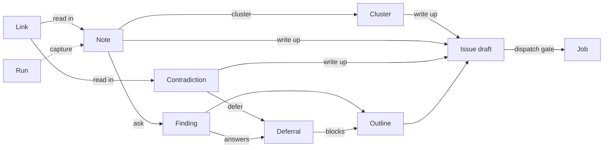

# Studio

**What it is:** A typed graph of what one stretch of work produced — notes, findings, links, deferrals and what each became — kept per repository and driven through Helm.

---

**Kind:** Entity, Surface.

A Studio is where a job is found before it is provided. You run the app and point at what is wrong, ask what the code does, read in a board or an old session, and promote what holds up into an issue draft and then a Job. The Studio keeps how that was reached, so it can be reread.

## What it is

> **Rule.** A Studio is a graph of typed nodes whose content is text, links or structured fields, and whose edges say where each node came from.
> Why: an agent can read a record and cannot read a drawing, and a Studio is read by agents as much as by a person.

> **Rule.** A Studio belongs to one repository.
> Why: it is driven through [Helm](helm.md), and Helm answers for one repository.

> **Rule.** The Studios list names each Studio and when it was last touched, and names no Workspace.

> **Rule.** A Studio is kept until a person deletes it. Nothing expires it.
> Why: rereading how a plan was reached is what it is for.

> **Rule.** A Studio reopens read-only, and a person continues it on request.

> **Rule.** A Studio is laid out by hand. A person places each node and moves it, and the Studio keeps every position.
> Why: where a person put a node is part of how they read the work.

> **Rule.** The whiteboard is drawn with React Flow.

**It is part of the product, not a transcript of one.** The conversation with Helm drives a Studio; the nodes and edges are what persists and what an agent reads. See [Scope](../scope.md).

## Nodes

| Kind | Holds | States | Colour |
|---|---|---|---|
| Run | A Manifest command started from the Studio, and its log until retention takes it | Run states | Job colours |
| Note | What a person pointed at and said, fixed at capture | None | None |
| Cluster | Notes a person accepted as one thing | None | None |
| Finding | What a scout learned, and everything it read | Proposed, Gathering, Frozen | None |
| Contradiction | Two sources that disagree, and its outcome | Reported, then its outcome | None |
| Sketch | A diagram or mockup, as structured content | Frozen | None |
| Link | A board, document, issue, page or session, kept as its address | None | None |
| Deferral | Something a person put off, against what it blocks | Open, Answered | None |
| Outline | An ordered reading of the nodes feeding it | Draft, Frozen | None |
| Issue draft | An issue's title and body, never filed by Armada | Draft | None |
| Job | A dispatched [Job](job.md) | Job statuses | Job colours |

| State | Means |
|---|---|
| Proposed | Suggested and not started. Carries its cost where it can be run |
| Gathering | Working, and spending |
| Frozen | Done changing. Still promotable |

> **Rule.** Run and Job nodes are the only nodes that take status colour, and each Run state aliases a Job status in `packages/tokens/src/status.css`.
> Why: a run reads the same on a Studio, on the Manifest surface and on a Job's run sheet. See [Run and edit a Manifest](../journeys/run-and-edit-a-manifest.md).

> **Rule.** Every working node pulses. See `../contracts/design-system.md`, Motion.

> **Rule.** A Run on a Studio writes no Evidence, the same as every run outside a Job.

> **Rule.** A Run node keeps its log's tail and its result — command, exit code and duration — once the run's retention passes, marked partial.
> Why: a Studio is kept until a person deletes it, and a run's full log is not.

> **Rule.** What it keeps is taken before the sweep, never after, and a run whose node could not keep it is not swept.
> Why: a tail read after the directory was removed is no tail, and the node would be left naming a run nobody can read.

> **Rule.** The kept tail is the log's last lines, bounded, and it lives in the node's own content.
> Why: a runner prints what failed last. A Studio crosses the wire whole on every write and is kept until a person deletes it, so a whole log on one is a cost with no end — and a file beside the Studio would be a second thing to sweep, which is the failure this rule exists against.

> **Rule.** A Run node is made by starting a run from the Studio, and by no other act.
> Why: what a node says about a run is read off the run, so a node added by hand could carry a result no run ever had.

### Names avoid words Armada already uses

| Node | Not called | Because that word already means |
|---|---|---|
| Note | Observation | The one flagged inference Helm may add to an answer |
| Link | Source | Verification source, in the Design System's hedging rule |
| Deferral | Question | A Drone's question on the dock, and an open question in `docs/` |
| Outline | Plan | A Job's own [Plan](plan.md) |
| Issue draft | Ticket | Banned by the lexicon as a word for a Job |

## Edges

| Edge | Means | Drawn by |
|---|---|---|
| Produced | The first node made the second | The Studio, always |
| Same as | Two nodes say one thing | Proposed, and a person accepts |
| Blocks | One has to land before the other | Proposed, and a person accepts |
| Answers | A Finding settles a Deferral | Proposed, and a person accepts |

> **Rule.** Only a person accepts a relation. Helm and a scout may propose one, drawn dashed until accepted.
> Why: an agent reorganising a person's work is what separates a drawing surface from a record of decisions.

> **Rule.** No edge carries colour. Weight and label tell them apart.

## Notes

> **Rule.** A Note is fixed at capture, and nothing writes to it afterwards.
> Why: it records a moment. What is learned about it later is a Finding, with its own cost and its own Produced edge.

> **Rule.** Studio capture works on Bridge, under its own binding in the shipped app.

> **Rule.** Capture on another repository's web app does not exist. It waits on a security review, #1294.
> Why: Bridge loads nothing but itself, and loosening that is a security review. See `../practices/bridge.md`, Security posture.

> **Rule.** The development annotation layer stays beside Studio capture, unchanged: ⌥⌘A under `pnpm dev`, a file under `.armada/annotations/`, Send to Fleet, and `/annotations`.
> Why: it is how a person annotates Bridge while building it. See `../practices/running-locally.md`, Annotating Bridge.

> **Rule.** A Note's frame is a file beside the Studio's records, and the Note names it. A frame over 4 MiB is refused.
> Why: an image in the content column is read back on every graph read and rides every `studio.changed`, for the life of a Studio nothing expires.

> **Rule.** A Note draws its frame on the Studio, small, and full size when it is opened. A Note that kept none draws no picture and says nothing about it; one whose frame cannot be read says so where the picture would be.
> Why: the frame is the field that says *this is what I was looking at*, and a missing picture is a Note without one rather than a failure. See `../practices/bridge.md`, Security posture, for how the bytes reach the window.

> **Rule.** A source file path is kept only where the build gives one, and absent otherwise.
> Why: React 19 fibers carry no `_debugSource`, and a guessed path sends a reader to the wrong file.

A Note carries what the annotation layer records, in `apps/desktop/src/shared/annotations.ts`, and four fields that layer does not record.

| Field | Recorded by the annotation layer today |
|---|---|
| What the person said | Yes |
| Element selector and visible text | Yes |
| Component and its owners | Yes, for React apps only |
| Screen, layer, location | Yes |
| Box and window size | Yes |
| Computed styles | No |
| Markup | No |
| A frame of the screen | No |
| Source file path | No |

## Promotion

| Rung | From | To | Who acts |
|---|---|---|---|
| Run | Any node, or nothing | Run | A person, or Helm on their ask |
| Read in | A Link | Notes, Clusters, Contradictions, proposed edges | A scout, on a person's ask |
| Capture | A person using an app | Note | The person |
| Ask | Any node | Finding | A scout, on a person's ask |
| Cluster | Notes | Cluster | A person accepts |
| Outline | The nodes feeding it | Outline | A person orders |
| Defer | Anything raised on a node | Deferral | A person, only |
| Write up | Note, Cluster, Contradiction or Outline | Issue draft | A person, or Helm on their ask |
| Dispatch | Issue draft | Job | The dispatch gate |

> **Rule.** Nothing promotes itself. A Note never written up is a finished outcome.

> **Rule.** A Job dispatches from an Issue draft's text, through the [Job proposer](job-proposer.md). Filing the issue on GitHub is optional and a person's own act.
> Why: nothing reaches outside Armada on a Studio's behalf. See [Scout](scout.md).

> **Rule.** An Issue draft carries its title and body whole to the proposer, in that order, and nothing between the two summarises, trims or re-fetches it.
> Why: a write-up is made from the nodes feeding it, and a lossy hop would hand a [Drone](drone.md) something other than what the person read.

> **Rule.** A Job dispatched from a Studio carries the origin of whoever pressed it, and no value of the Studio's own. The `Produced` edge from the Issue draft is where a Job's Studio is recorded.
> Why: `origin` is written from `dispatched_by`, and who dispatched is a person or Helm here as everywhere else. What it is not is *Found by Fleet*, which names work Armada noticed by itself.

> **Rule.** An Issue draft's title and body are a person's to edit, and nobody else's, whatever is asked.
> Why: an agent rewriting a draft a person edited is an agent reorganising a person's work, and what is dispatched has to be what they read.

> **Rule.** The order of an Outline is the order a person put its nodes in, kept as the order of its `Produced` edges.

A Contradiction ends in one of four ways, and a person picks which.

| Outcome | When | How |
|---|---|---|
| Issue draft | One side is stale, and a file needs fixing | Writing it up, which ends it as it goes |
| Deferral | It is a real decision, and the person defers it | Deferring on it, which ends it as it goes |
| Not a problem | Both statements hold, in different contexts | Settling it |
| Resolved here | The person settles it, and the node records the answer | Settling it, with the answer |

> **Rule.** A Contradiction ends once, and the outcome kept is the one that was acted on.
> Why: two of the four leave a node behind, and re-ending one would leave that node pointing at a Contradiction that no longer says where it came from.

> **Rule.** Two of the four outcomes are the rungs that make a node, and the other two are their own act.
> Why: one way to make an Issue draft and one way to make a Deferral. A second route to either would be a second place the `Produced` edge is drawn.

## Helm on a Studio

| Helm may, unasked | Helm may, only on a person's ask |
|---|---|
| Add a node marked Proposed, with its cost | Start a scout |
| Propose an edge | Start a Run |
| Name an untitled Studio | Write up, and dispatch |

> **Rule.** One ask may cover writing up and dispatching when it names both. "Write it up" alone never dispatches.
> Why: Helm approves a dispatch on a person's ask and never as a silent follow-on to drafting. See [Helm](helm.md), Action authority.

> **Rule.** Accepting an edge, deferring, grouping, editing an Issue draft, ending a Contradiction and deleting a node are a person's acts, whatever is asked.

> **Rule.** Every act Helm takes on a Studio is published as `studio.helm_acted`, apart from a person's, and the Studio keeps who added each node and edge and who named it.
> Why: Helm's acts are their own event type, and a stream a client missed is not a log. See [Helm](helm.md), Audit trail.

> **Rule.** Helm reads the runs it can start in the checkout.
> Why: a run answers at once and ends on an event a Helm session never receives, so a run Helm could start and not read back would be an act it could not report on.

## The vocabulary is a table until code reads it

> **Rule.** Node kinds, edge kinds and promotions live on this page until code reads them, then move to a data file beside `crates/core-model/domain/` with a check over it.
> Why: a set nobody's code reads stays a table; a set code reads is a data file. See `.claude/skills/armada-documents/SKILL.md`.

| The check will refuse | Rule it holds |
|---|---|
| Status colour on a kind other than Run or Job | Status colour stays tied to declared states |
| A Run state with no alias in `status.css` | Run nodes take Job colours |
| A relation drawn by anything but the Studio or a person's acceptance | Only a person accepts a relation |
| A promotion that writes outside Armada | Scouts read and never write |
| A node name on a lexicon *Never* list | Names avoid words Armada already uses |
