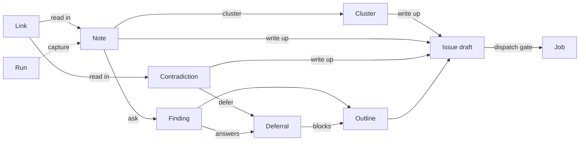

# Studio

**What it is:** A typed graph of what one stretch of work produced — notes, findings, links, deferrals and what each became — kept per repository and driven through Helm.

---

**Kind:** Entity, Surface.

A Studio is where a job is found before it is provided. You run the app and point at what is wrong, ask what the code does, read in a board or an old session, and promote what holds up into an issue draft and then a Job. The Studio keeps how that was reached, so it can be reread.

## What it is

> **Rule.** A Studio is a graph of typed nodes whose content is text, links or structured fields, and whose edges say where each node came from.
> Why: an agent can read a record and cannot read a drawing, and a Studio is read by agents as much as by a person.

> **Rule.** A Studio belongs to one repository.
> Why: it is driven through [Helm](helm.md), and Helm answers for one repository.

> **Rule.** The Studios list names each Studio and when it was last touched, and names no Workspace.

> **Rule.** A Studio is kept until a person deletes it. Nothing expires it.
> Why: rereading how a plan was reached is what it is for.

> **Rule.** A Studio reopens read-only, and a person continues it on request.

> **Rule.** A Studio is laid out by hand. A person places each node and moves it, and the Studio keeps every position.
> Why: where a person put a node is part of how they read the work.

> **Rule.** The whiteboard is drawn with React Flow.

**It is part of the product, not a transcript of one.** The conversation with Helm drives a Studio; the nodes and edges are what persists and what an agent reads. See [Scope](../scope.md).

## Nodes

**The kinds are `crates/core-model/domain/studio-kinds.toml`** — each with what it holds, the states it may take, whether it draws in Job colours, whether a person adds one by hand and whether it offers Dispatch. The rules below are what the gate holds that file and its three readers to.

> **Rule.** Run and Job nodes are the only nodes that take status colour, and each Run state aliases a Job status in `packages/tokens/src/status.css`.
> Why: a run reads the same on a Studio, on the Manifest surface and on a Job's run sheet. See [Run and edit a Manifest](../journeys/run-and-edit-a-manifest.md).

> **Rule.** A Job node holds a reference to its Job and no copy of its status. It reads that status off the same rows the [Job Board](job-board.md) reads, so a Studio left open and come back to says what the Job is doing now.
> Why: a Studio is kept until somebody deletes it and a Job moves all day. A status written onto a node would be right once.

> **Rule.** A Job node opens its Job, the way a Board row does. The press is an act on the selected node rather than on the card, because the whiteboard is a drag surface.
> Why: reviewing and deciding happens on Job detail and nowhere else, so a Job on a Studio that could only be looked at would be a dead end. The way back is `#1362`.

> **Rule.** A Job killed and redispatched arrives on every Studio holding it as a Job node of its own, beside the one it replaced, under a `Produced` edge from it. The node it replaced is neither rewritten nor removed, and keeps reading the Job that stopped. `#1440`.
> Why: one Job made the next and neither waits on the other, which is `Produced` rather than `Blocks`. A Studio is a record: the Job that was killed really ran, and a node repointed at the replacement would lose what it did.

> **Rule.** The replacement is drawn on the redispatch, never on the next read of the Studio.
> Why: a Studio somebody had open through the redispatch is written to by the act, and learns from the `studio.changed` that follows. Drawn on a read, where a node lands would be decided by whoever read it first — and where a node is is a person's.

> **Rule.** One node per Job, however many times a Job is redispatched. A Job redispatched twice leaves two replacements, each under its own `Produced` edge from the Job they replaced, and no Job appears twice.
> Why: two Jobs may name one predecessor, because `killed` is itself redispatchable — [Job](job.md), *A redispatch is read from both ends*. Both replacements are Jobs that really exist and really run, so drawing one and hiding the other would be the Studio deciding which work counts; drawing one Job twice would be two nodes claiming to be the same live one.

> **Rule.** Every working node pulses. See `../contracts/design-system.md`, Motion.

> **Rule.** A Run on a Studio writes no Evidence, the same as every run outside a Job.

> **Rule.** A Command with `serve` is a Run node, and not a kind of its own. It reads *starting*, then *serving* with how long it has been up, a button per link and Stop; a server that exits on its own reads as a failure with its exit code, whatever that code is.
> Why: it is a Manifest command started from the Studio, which is what a Run node holds, and Run is one of only two kinds that may take status colour — which both of a server's states need. See [Run and edit a Manifest](../journeys/run-and-edit-a-manifest.md), *A server*.

> **Rule.** A Run node holding a server reads the live instance Fleet is holding, and keeps no copy of it. One already serving is handed to the Studio that asks, and no second copy starts.
> Why: [Fleet](fleet.md) holds one instance per Job or checkout, and a state written onto the node would be right once. A server's ports come from the checkout's own span, never from the Studio.

> **Rule.** Closing a Studio leaves a server running, the way closing a run sheet does. Stop on its node is what ends it.
> Why: a person closes a whiteboard to look at what the server is drawing.

> **Rule.** A Run node keeps its log's tail and its result — command, exit code and duration — once the run's retention passes, marked partial.
> Why: a Studio is kept until a person deletes it, and a run's full log is not.

> **Rule.** What it keeps is taken before the sweep, never after, and a run whose node could not keep it is not swept.
> Why: a tail read after the directory was removed is no tail, and the node would be left naming a run nobody can read.

> **Rule.** A server's node keeps the same the instant the server ends, and the log's tail with it.
> Why: a run's record is a directory that outlives Fleet, so the sweep is the last moment it can be read; a server's is Fleet's own memory, which a restart takes. The rule is the same one — keep it at the last moment it is readable — and where that moment falls is who holds it.

> **Rule.** The kept tail is the log's last lines, bounded, and it lives in the node's own content.
> Why: a runner prints what failed last. A Studio crosses the wire whole on every write and is kept until a person deletes it, so a whole log on one is a cost with no end — and a file beside the Studio would be a second thing to sweep, which is the failure this rule exists against.

> **Rule.** A Run node is made by starting a run from the Studio, and by no other act.
> Why: what a node says about a run is read off the run, so a node added by hand could carry a result no run ever had.

> **Rule.** A person adds a Note, an address and a Sketch by hand, and no other kind. Every other kind is made by the act that earns it.
> Why: a Finding comes from a scout, a Run from a run, a Cluster or a Deferral from promotion, an Issue draft from writing up, a Job from dispatch. One of those added by hand would carry a claim nothing stands behind. Decided with the owner, #1364.

> **Rule.** An address is pasted, and never named as a kind. What arrives is an address; what it becomes is the adapter's answer.
> Why: nobody may say *this is an Issue* — the address earns the kind or it does not. See #1394.

> **Rule.** A Note typed by hand is fixed the moment it is made, as a captured one is.
> Why: nothing writes a node's content afterwards, and the rule that makes a Note a record does not depend on how it arrived.

> **Rule.** A pasted address is the kind it names, and an adapter decides which. An issue's address makes an Issue, a pull request's a Pull request, and the address of a set of issues an Epic. Everything else stays a Link.
> Why: what a node is belongs in its kind, not in a field read at render time — otherwise the fields each kind needs have nowhere to live and every new source of work adds a branch in one place. **A kind is a concept, never a vendor**: an Issue is an Issue whoever serves it, and a second forge is a second adapter rather than a fourth kind. See #1394.

> **Rule.** A Studio holds an address's number as a field, and its title and state only once something has read it in.
> Why: a number is on the address and costs nothing; a title and a state are the forge's to answer, and a fetch inside the paste would make pasting an address slow and able to fail.

> **Rule.** An Issue, a Pull request and an Epic are Armada's record of somebody else's thing, and hold no state of Armada's own. Where one stands on its forge is a field.
> Why: a state on this page is a lifecycle Armada moves a node through. Nothing here moves an issue.

> **Rule.** A node with an address keeps a line of the person's own beside it, taken when they paste it and theirs to change afterwards. The node draws that line, with the address under it.
> Why: a Studio holding several addresses reads as a list of URLs otherwise, saying nothing about why any of them was kept.

> **Rule.** A node with an address never stops being its address. Whatever is typed beside it is additional, and one with no line is drawn by its address.
> Why: the address is what a scout reads in. See #1378.

> **Rule.** Pasting an address offers what to do with it — read it in, or keep the link — and says what reading it in would produce. Where reading in is not built, the offer says so rather than drawing the choice dead.
> Why: a node that appears and offers nothing is the surface saying the person's paste did not matter.

> **Rule.** A node lands where the person is looking, not at the origin.
> Why: a Studio is laid out by hand, and a node placed off-screen is a node a person has to go and find.

> **Rule.** Deleting what is picked is one write, however many are picked: all of them or none.
> Why: half a delete is a board a person has to reconcile by reading it, and nothing here undoes one. See #1411.

> **Rule.** A delete counts rather than names, confirms once for the selection, and says before the press what goes that the person did not pick: the edges on the nodes going, including any reaching a node that stays, and the frame a captured Note keeps. A node one of them produced stays where it is, and a Job node's Job is untouched.
> Why: eighteen titles is a panel taller than the window it is drawn in, and what a person is owed before an act with no undo is its reach rather than its list.

### Names avoid words Armada already uses

> **Rule.** No node is named a word the lexicon in `../contracts/design-system.md` says never to use, and the word each kind was called instead is `not_called` on its registry row, with why that word was already taken.
> Why: a second name for something Armada already has is a vocabulary splitting, and the split is invisible until two things that mean the same render differently.

**Run is the one exception, and it is scoped.** The lexicon bans `run` under **Job**, where it bans calling a Job a run. A Run node is a run.

## Edges

**The edge kinds and who draws each are `crates/core-model/domain/studio-kinds.toml`.**

> **Rule.** Only a person accepts a relation. Helm and a scout may propose one, drawn dashed until accepted.
> Why: an agent reorganising a person's work is what separates a drawing surface from a record of decisions.

> **Rule.** No edge carries colour. Weight and label tell them apart.

## Notes

> **Rule.** A Note is fixed at capture, and nothing writes to it afterwards.
> Why: it records a moment. What is learned about it later is a Finding, with its own cost and its own Produced edge.

> **Rule.** Studio capture works on Bridge, under its own binding in the shipped app.

> **Rule.** Capture on another repository's web app happens in a window of its own, opened from a serving Run and pinned to that Run's own loopback origin. Bridge's window loads nothing but itself and that does not change. #1294.
> Why: what that window may load, what the layer injected into the page may touch and send back, and what is refused outright are settled in `../practices/capture-window.md`.

> **Rule.** The development annotation layer stays beside Studio capture, unchanged: ⌥⌘A under `pnpm dev`, a file under `.armada/annotations/`, Send to Fleet, and `/annotations`.
> Why: it is how a person annotates Bridge while building it. See `../practices/running-locally.md`, Annotating Bridge.

> **Rule.** A Note captured there records the Run and the origin it was pinned to, beside everything a Note captured on Bridge records.
> Why: a Studio holds Notes from Bridge and from several servers at once, and a Note that does not say which is a Note about an unnamed page. `StudioCapture.served`, protocol 16.6.

> **Rule.** A Note's frame is a file beside the Studio's records, and the Note names it. A frame over 4 MiB is refused.
> Why: an image in the content column is read back on every graph read and rides every `studio.changed`, for the life of a Studio nothing expires.

> **Rule.** A Note draws its frame on the Studio, small, and full size when it is opened. A Note that kept none draws no picture and says nothing about it; one whose frame cannot be read says so where the picture would be.
> Why: the frame is the field that says *this is what I was looking at*, and a missing picture is a Note without one rather than a failure. See `../practices/bridge.md`, Security posture, for how the bytes reach the window.

> **Rule.** A source file path is kept only where the build gives one, and absent otherwise.
> Why: React 19 fibers carry no `_debugSource`, and a guessed path sends a reader to the wrong file.

A Note carries what the annotation layer records, in `apps/desktop/src/shared/annotations.ts`, and four fields that layer does not record.

| Field | Recorded by the annotation layer today |
|---|---|
| What the person said | Yes |
| Element selector and visible text | Yes |
| Component and its owners | Yes, for React apps only |
| Screen, layer, location | Yes |
| Box and window size | Yes |
| Computed styles | No |
| Markup | No |
| A frame of the screen | No |
| Source file path | No |

## Promotion

**The rungs are `crates/core-model/domain/studio-kinds.toml`** — each with what it starts from, what it makes and who acts. Every rung ends at a node kind, which is *nothing reaches outside Armada on a Studio's behalf* written as something a set lookup can check.

> **Rule.** A node read in keeps its address, and everything that came back hangs off it by `Produced` edges.
> Why: the address is what a Job is dispatched from, and a Link rewritten by what was read in it would be a record of the reading rather than of the source.

> **Rule.** An Epic reads in as one Issue per issue, each carrying that issue's own address, number, title and state, and makes no Issue draft.
> Why: an Issue draft is Armada's own unfiled text. An issue already on a forge is an Issue node, and dispatching from it is the address's job. The read already answers all three fields, so nothing is left for a later fetch.

> **Rule.** An Epic read-in is bounded, and the Epic itself says how many of how many were read in.
> Why: a Studio is laid out by hand, and a hundred nodes landing at once is a board nobody can arrange — but a bound nothing says is a board claiming to be a milestone.

> **Rule.** Reading an Epic in asks which of its issues to take: every issue, or only what is open. The bound is applied to what it took, never before.
> Why: a person reading a milestone to plan work wants the open ones and a person reading one to see what shipped wants all, and a read-in that picked for them fills a Studio with work that is already done. A bound applied first would take fifty issues and show whichever of them happened to be open, which is a bound on the wrong set. See #1405.

> **Rule.** The Epic keeps the answer, and reading it in again with the other answer widens or narrows what is on the Studio. Nothing re-reads on its own.
> Why: an issue that closes later is not a node that should disappear. Which of its issues are worth looking at is a person's judgement, and it changes as the work does.

> **Rule.** An Epic says which of its issues it took, how many that left out and how many it kept, beside how many of how many are on the Studio. An Epic read in before the answer existed says nothing about one.
> Why: a board narrower than the milestone and a board that is the milestone read the same otherwise. A count drawn as an answer nobody gave is a claim.

> **Rule.** Narrowing takes back only the Issue nodes the read-in made, and never one a person has worked on: one carrying an edge beyond the `Produced` edge that made it, a line of their own beside its address, or a position off the block it was laid out in. The Epic counts what it kept.
> Why: a person's own work is not the read-in's to remove, and a Note written against a closed issue, a Deferral raised on it and a Job dispatched from it are all that work. An Issue is never added by hand — a person pastes an address — so an Issue hanging off an Epic is that Epic's read-in's and nothing else is.

> **Rule.** An Epic's issues sit in one block for the Epic's life, and a read-in fills that block's gaps rather than starting a second one.
> Why: a widening that laid a second grid wherever the person was looking would leave one milestone drawn in two places — and where a node was put is only readable as a person's own act against a block that is still where it was laid out.

> **Rule.** An Epic takes no scout and leaves no Finding.
> Why: nothing was learned; a list was copied. A model asked to echo one back is cost spent on a transcription, and a Finding that cost nothing and read nothing says nothing.

> **Rule.** A read-in whose answer is not the shape asked for makes no node, and its Finding still says what the scout said.
> Why: a Studio is read by agents as much as by a person, and a Note carrying an apology is a record of nothing.

> **Rule.** Nothing promotes itself. A Note never written up is a finished outcome.

> **Rule.** A Job dispatches from an Issue draft's text, through the [Job proposer](job-proposer.md). Filing the issue on GitHub is optional and a person's own act.
> Why: nothing reaches outside Armada on a Studio's behalf. See [Scout](scout.md).

> **Rule.** An Issue, a Pull request and an Epic dispatch their address, through the same gate, and nothing is filed because what the address names already exists. A Link dispatches nothing.
> Why: an Issue draft is Armada's own unfiled text and these three are things somebody already has, and the proposer takes such a link as a request. A Link is an address nothing recognised, so there is nothing filed to dispatch against.

> **Rule.** The address is the whole request and nothing beside it names a workflow.
> Why: an issue is a change to make, a pull request is work already written that wants a judgement, and an Epic is a wave to split — three asks, and which workflow each runs under is the [Job proposer](job-proposer.md)'s own decision off the request and each definition's `for_requests` line. A surface that picked one would be deciding what that page makes the proposer's.

> **Rule.** An Epic both reads in and dispatches, and the two are not rivals.
> Why: reading one in puts its issues on the board to work through one at a time; dispatching one asks for the whole wave at once. A person picks which they meant.

> **Rule.** What an address names is decided once, by `crates/adapters`, when the node is made — and no surface works it out.
> Why: which host is the forge is that crate's to know, and a second reading of an address would be a second answer the day the first changes. An address is fixed at paste, so nothing kept off it can go stale. See `../practices/protocol.md`, Protocol 14.18.

> **Rule.** A Link already on a Studio whose address an adapter recognises becomes the kind it names, keeping its id, its position, its edges and the line beside it.
> Why: the same address pasted twice would otherwise be two nodes with two behaviours, which is the defect this replaced. See #1394.

> **Rule.** An Issue draft carries its title and body whole to the proposer, in that order, and nothing between the two summarises, trims or re-fetches it.
> Why: a write-up is made from the nodes feeding it, and a lossy hop would hand a [Drone](drone.md) something other than what the person read.

> **Rule.** A Job dispatched from a Studio carries an origin that says both where it came from and who pressed it — `studio_dispatched` or `studio_helm_drafted`. The `Produced` edge from the Issue draft is still the only record of *which* Studio.
> Why: the [Board](job-board.md) row has to say it came off a Studio, and it cannot stop saying whether you or Helm sent it, so one value carries both clauses. What it is not is *Found by Fleet*, which names work Armada noticed by itself. See #1362.

> **Rule.** An Issue draft's title and body are a person's to edit, and nobody else's, whatever is asked.
> Why: an agent rewriting a draft a person edited is an agent reorganising a person's work, and what is dispatched has to be what they read.

> **Rule.** The order of an Outline is the order a person put its nodes in, kept as the order of its `Produced` edges.

A Contradiction ends in one of four ways, and a person picks which. The four are its last four states in `crates/core-model/domain/studio-kinds.toml`, which says when each holds; this is the act that reaches each.

| Outcome | How |
|---|---|
| Issue draft | Writing it up, which ends it as it goes |
| Deferral | Deferring on it, which ends it as it goes |
| Not a problem | Settling it |
| Resolved here | Settling it, with the answer |

> **Rule.** A Contradiction ends once, and the outcome kept is the one that was acted on.
> Why: two of the four leave a node behind, and re-ending one would leave that node pointing at a Contradiction that no longer says where it came from.

> **Rule.** Two of the four outcomes are the rungs that make a node, and the other two are their own act.
> Why: one way to make an Issue draft and one way to make a Deferral. A second route to either would be a second place the `Produced` edge is drawn.

## The way back from a Job

A Job is the thing in front of a person long after the Studio that produced it
has scrolled out of mind, and the notes, the finding and the draft that made it
worth doing are all still there. **Job detail names the Studio and opens it**,
under *Where things are* with the worktree and the branch — the region for a
value you want to reach rather than one you are reading.

> **Rule.** Opening a Studio from a Job selects the Job's own node on it.
> Why: the person is going back to the part of the graph the work came from, not to a whiteboard with nothing picked. The node is the edge's own end, so the read that finds the Studio has already found it.

> **Rule.** Which Studio produced a Job is read off the `Produced` edge into its Job node, and is written nowhere on the Job.
> Why: a forward column would be a second write that can disagree with the edge and outlive what it points at — the argument a redispatch's replacement is read as a predicate for, `#1439`. See `../practices/protocol.md`, Protocol 16.4.

> **Rule.** A Job whose Studio has been deleted still says it came off one, and says the Studio is no longer there rather than offering a control that opens nothing.
> Why: the origin is stored and survives; the edge cascades with the Studio and does not. A dead press is worse than a plain sentence — [Job Board](job-board.md)'s *A Board outlives its Workspace*.

> **Rule.** One Job, one Studio. A Job reaches the Board from one Issue draft, so the detail names one and never a list.

## Helm on a Studio

| Helm may, unasked | Helm may, only on a person's ask |
|---|---|
| Add a node marked Proposed, with its cost | Start a scout |
| Propose an edge | Start a Run |
| Name an untitled Studio | Write up, and dispatch |

> **Rule.** A person names a Studio where its name is drawn, on the list row and on the open Studio, and Helm keeps naming an untitled one unasked.
> Why: naming is not an act that needs a conversation. Helm's half of it exists because an untitled Studio is worth naming whether or not anyone gets round to it.

> **Rule.** One ask may cover writing up and dispatching when it names both. "Write it up" alone never dispatches.
> Why: Helm approves a dispatch on a person's ask and never as a silent follow-on to drafting. See [Helm](helm.md), Action authority.

> **Rule.** Accepting an edge, deferring, grouping, editing an Issue draft, ending a Contradiction and deleting a node are a person's acts, whatever is asked.

> **Rule.** Every act Helm takes on a Studio is published as `studio.helm_acted`, apart from a person's, and the Studio keeps who added each node and edge and who named it.
> Why: Helm's acts are their own event type, and a stream a client missed is not a log. See [Helm](helm.md), Audit trail.

> **Rule.** Helm reads the runs it can start in the checkout.
> Why: a run answers at once and ends on an event a Helm session never receives, so a run Helm could start and not read back would be an act it could not report on.

## The vocabulary is a file code reads

> **Rule.** `crates/core-model/domain/studio-kinds.toml` is the authority on the node kinds, their states, the edge kinds, the forge states, an Epic's take and the promotions. This page states the rules those sets serve and spells none of them again.
> Why: a set nobody's code reads stays a table; a set code reads is a data file with a check over it. See `.claude/skills/armada-documents/SKILL.md`.

> **Rule.** `cargo xtask verify-foundations` holds that file to the enums in `crates/core-model/src/studio.rs`, the `CHECK` constraints in `crates/store/src/studio.rs` and the mirror in `packages/protocol/src/studio.ts`, both ways and on wire spellings. `xtask/src/rules_studio.rs` says what it refuses.
> Why: the three were spelled separately and nothing compared them, so a kind added to one merged green and failed the first time a person met it. `#1313`.

> **Rule.** Widening a set means a new migration, never an edit to one that has already run. SQLite cannot widen a `CHECK`, so `crates/store/src/studio.rs` rebuilds both tables.
> Why: `V79` did exactly that for the three forge kinds, and the gate reads the last `CREATE TABLE` for each table — which is the set a fresh database gets.

**What the check does not hold.** Each Run state's alias in `packages/tokens/src/status.css`: those four states are a run's rather than a Studio's, and no enum spells them, so there is nothing yet to compare against.
