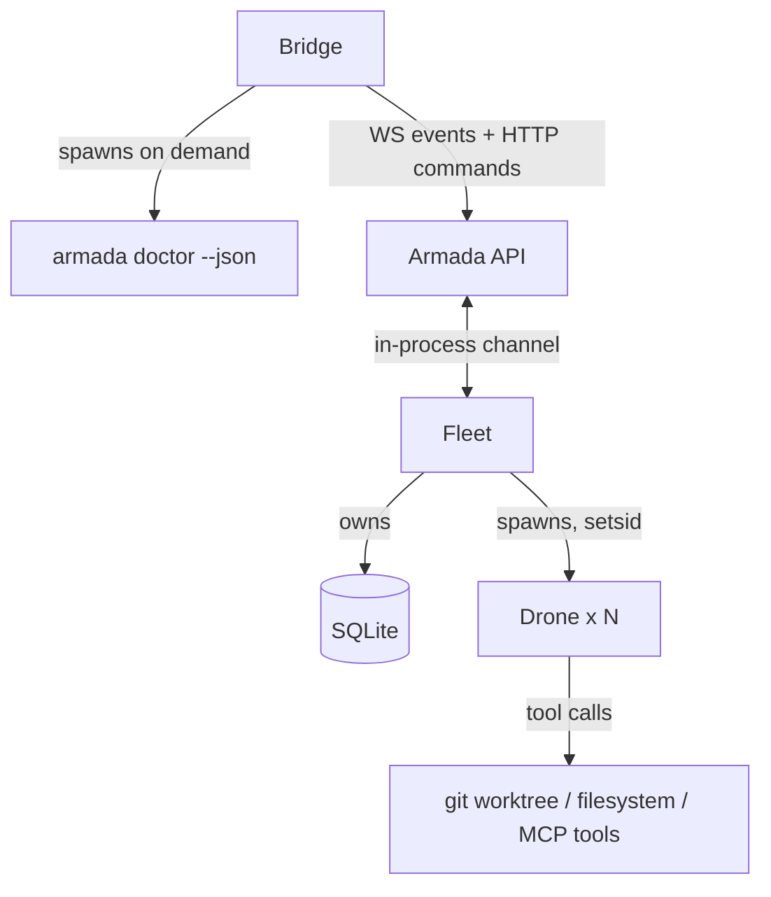

# System Architecture

**Kind:** reference. **Governs:** topology, tech stack, trust boundaries and
the component taxonomy. Section 9 defines the Kind vocabulary that the
Armada Concepts database uses; crate structure lives in the Armada Crates
database and the operation inventory in Armada Operations, and this document
states the rules that govern them.

One place that states how Armada fits together at runtime, what it is built
from, and what the parts are called. This document owns topology, tech
stack, trust boundaries, and the component taxonomy. It defers detail rather
than duplicating it.

**What this document does not own:** crate structure lives in the Armada
Crates database. Workflow schema and evidence gates live in the Workflow
Design System. Per-setting detail lives in [Configuration](configuration.md).
Individual component definitions live in the Armada Concepts database.

Open decisions are tracked in the Armada Decisions database rather than
guessed at.

---

# 1. Scope

Armada is a single-user macOS desktop application that dispatches Claude
Code agents against local git repositories and verifies their work before
advancing them. There is no auth layer, no server component, and no cloud
telemetry. Everything runs on one machine.

| In scope for v2.0 | Out of scope |
| --- | --- |
| macOS | Windows, Linux |
| Single user, one machine | Multi-user, shared team view, auth |
| Local SQLite, local JSON logs | Cloud tracing, hosted telemetry |
| Claude Code CLI as the agent harness | Other harnesses (trait exists, no impl) |

---

# 2. Runtime topology

Six process classes.

**Armada API and Fleet are one process.** The edge between them is an
in-process channel — a real channel, not a placeholder — drawn because the
crate seam is real: `api` does not depend on `fleet`. A second daemon was
rejected. It would have moved `store`, `config` and `adapters` across a
process boundary, needed a 13th crate, and was measured to cause checkpoint
starvation: 44 MB of WAL in 7 s from one leaked cross-process read
transaction. Doctor's blind spot, the whole argument for splitting, is
closed instead by `armada doctor --json`, a short-lived probe process
Bridge spawns. See the decision on Fleet process topology and supervision,
in Armada Decisions.

| Process | Language | Lifetime | Started by |
| --- | --- | --- | --- |
| Bridge | TypeScript / Electron | While the app is open | The user |
| Fleet | Rust | Survives Bridge close. Ends on reboot or force-kill | The user, by hand, until the Ship milestone puts it under launchd |
| Drone | Claude Code CLI, headless | One Job | Fleet, after human approval |
| Helm | Agent session | One conversation, per Manifest | The user, by selecting a Manifest in Bridge |
| SQLite | File, WAL mode | Persistent | Fleet, via the `store` crate |
| `armada doctor --json` | Rust, same binary as Fleet | ~253 ms warm. One scan, then it exits | Bridge, on demand |

**Why Fleet outlives Bridge.** Bridge and Fleet have independent lifetimes,
which is the load-bearing fact of this section. Jobs keep progressing with
the window closed. Reopening Bridge reconnects to the running daemon rather
than spawning a second one. This is also why protocol skew is dangerous: it
happens mid-Job, with Drones burning tokens. See the lifeboat in section 6.

**Why a separate daemon rather than an embedded backend.** Fleet must
outlive the Electron window. The same choice leaves room for a future
non-Electron client, web or mobile, against the same backend.

**Bridge finds Fleet through a runtime file** carrying port, pid and
protocol version, written on startup and removed on clean exit. Bridge
verifies the pid before connecting, which is what separates "Fleet is not
running" from "running and unreachable" — two states that look identical to
a connection timeout.

**Bridge never talks to a Drone.** Every Drone interaction is mediated by
Fleet. Bridge talks to one peer, Armada API — the Board's socket, and a second
opened per Job for observing a Drone's turns.

---

# 3. Process lifecycle

Fleet's daemon lifecycle — startup, crash, wedge, deliberate exit,
reconciliation, uninstall — is owned by Fleet and measured there. What
matters at the architecture level is that **Bridge and Fleet have
independent lifetimes**, and what happens to Drones underneath.

| Transition | State |
| --- | --- |
| Drone spawn | Fleet spawns after human approval, always with `libc::setsid()` — launchd signals a job's whole process tree, so an undetached Drone dies at every Fleet restart. Resource headroom gating arrives with the Throughput milestone, since nothing contends while one Drone runs at a time. Config is frozen **for the Job** for Skills, MCP, agent files, commands and Voice — snapshotted at Job creation, not at spawn, because a Drone belongs to a workflow step and a Job spawns one per step; allowlist, budget and freeze stay live at gated checkpoints |
| Drone teardown | **The worktree belongs to the Job, not the Drone.** "Drone exited" is never grounds to remove one, since rescope-and-respawn reuses it and Pilot hands a human a terminal inside it. Removal is driven by Job retention. See the decision in Armada Decisions |

**Fleet auto-kills only at a cap.** Anything escalated is paused with its worktree
held as-is. Killing is exclusively a human action — which is why `setsid`
at Drone spawn is not a detail: without it, every Fleet restart kills every
Drone silently, mid-Job.

**Reconciliation covers half the cases.** A Job whose Drone is gone is
flagged `interrupted`. A Job **whose Drone is still alive and orphaned** —
now reachable, because detached Drones survive a Fleet restart — is not yet
specified, open in Armada Decisions.

---

# 4. Tech stack

| Layer | Choice | Why |
| --- | --- | --- |
| Desktop shell | Electron | Multi-Drone monitoring, diffs, real-time panes. v1's recorded pain was the terminal surface, not the engine: 9 of 11 readable failures were layout, legibility, or freeze complaints |
| Renderer build | electron-vite, `apps/desktop` | Set up in M0 — Foundations |
| UI | React, shadcn primitives, lucide-react icons | Job Board row must build from tokens and shadcn alone, nothing invented |
| Design tokens | `packages/tokens` | Shared across surfaces. Status tokens double as Doctor's pass/warn/fail palette |
| JS package manager | pnpm workspace | Sits beside the Cargo workspace in one repo. Fleet and Bridge version together |
| Backend | Rust, 12-crate Cargo workspace | Seams justified by v1 measurement, not prediction. See the Armada Crates database |
| Persistence | SQLite, WAL mode | Concurrent Drone writes need queryability and safe concurrency. Drone counts stay low, so contention is not expected |
| Transport | WebSocket + HTTP (JSON), **axum** | WS for the event stream, HTTP for queries and commands, **one listener** — verified, no second port. Allows a future non-Electron client, and better than gRPC would have: every language speaks HTTP and WS without codegen. gRPC and `tonic` were rejected on measured cost — see the `api` row in the Armada Crates database |
| Agent harness | Claude Code CLI, headless, `--strict-mcp-config` | Reuses built-in tool handling and permissions instead of reimplementing an agent loop. **Output is structured and parses** — measured against 2.1.241, with the transcript pinned as the format-drift reference. Denials appear as their own events rather than as prose. The PTY-wrap fallback is retired |
| VCS | git2, one worktree per Drone | Worktree confinement is the real safety boundary |
| Secrets | macOS Keychain, brokered by Fleet | A Drone never holds a secret directly |
| Observability | Structured JSON logs per Job, local | No cloud tracing. Logging stays fully local |

**Dependency discipline.** `cargo tree` must show no tokio, git2 or reqwest
under `core-model` or `adapter-traits`. This is checked in CI, not by
review.

## Why Electron and not a TUI

**The evidence is recorded, not a general preference.** Of 77 failure and
inbox entries in v1, 9 of 11 readable failures were the same complaint in
different words: the Bridge froze, resizing broke the layout, the legend
was illegible, the columns flip-flopped, there are conflicts and no way to
see what they are. The recorded pain was the surface, not the engine.

A fixed-width terminal pane cannot hold a diff, an evidence bundle or a
design doc, and it was measurably slow and freeze-prone. Electron's runtime
overhead is the accepted cost of multi-Drone visualization.

**Review and reply are one loop, not two.** Reviewing and deciding is a
back-and-forth exercise and feedback has to reach the Drone, so a design
that puts review and reply in separate surfaces — or even separate panels —
recreates the v1 problem inside Electron. **Bridge's review UI keeps review
and reply-with-feedback as a single continuous interaction.**

---

# 5. Data architecture

**SQLite in WAL mode** holds Manifests, Jobs, Workflow and Status.
**Evidence is relational** — its own table, one row per entry, indexed by
step and by Manifest reference. **Facts is append-only text**, written once
per entry and never rewritten. They stopped being the same kind of thing
once Evidence gained per-criterion rows, verdicts and citations. See the
decision in Armada Decisions. The rationale: concurrent Drone writes need
queryability and safe concurrent access, WAL serializes writes safely, and
dispatch approval plus resource gating keep concurrent Drone counts low
enough that contention is not expected. Revisit only if concurrency scales
up.

**Schema versioning is auto-increment plus migration scripts**, Rails or
Django style, applied on Fleet startup. This covers both Manifest and Job
schemas.

**`store` is the only crate that deserializes**, which the Cargo graph
enforces on its own since the SQLite dependency is scoped to it alone.
Query functions never return pre-filtered results; they return parse
failures the caller cannot silently ignore. See the `store` row in the
Armada Crates database.

## Table map

Every write goes through `store`; the writer column names which crate calls
it.

| Table | Holds | Written by |
| --- | --- | --- |
| `schema_version` | One row. Auto-increment integer, checked on Fleet startup | `store` |
| `manifests` | Registered workspaces — repo path, workspace root, resolved config snapshot, schema version | `config` |
| `jobs` | The status machine, type (WorkflowDef ref), manifest ref, current step pointer, timestamps. No `shape` column — shape is derived from `write_targets` and `atomic`. States and reasons live on Job, and a reason is scoped by the status it sits under rather than flat, so no single reason count describes the set. `Job::transition` is the sole mutator | `fleet` |
| `job_steps` | The nested workflow machine — one row per (job, step), written at Job creation from the frozen WorkflowDef. State, last verdict, counters. What the top level calls `step_activity` and `last_step_verdict` is this table read at `jobs.current_step_id`, not a second copy | `fleet` |
| `job_dependencies` | DAG edges. `(from_job, to_job)`, branch and fan-in both allowed | `fleet` |
| `job_manifests` | The gate list — Manifests whose Checks gate a Job, one row per entry | `fleet` |
| `job_write_targets` | The paths a Job intends to write, one row per path. The Workspace set a Job spans is derived from them nearest-ancestor rather than stored | `fleet` |
| `job_facts` | Append-only Facts text, one row per entry. Never updated in place | `fleet` |
| `drone_runs` | One row per spawn. PID, worktree path, frozen config snapshot, exit state, spawn ordinal — which counts spawns against one Job, not step failures; the per-step retry counter lives on `job_steps`. **Whether this is its own table or columns on `jobs` is open** — a retry spawns a second run against one Job, which is what argues for the table. See the deferred gaps in section 10 | `fleet` |
| `evidence` | Per-step bundles from the Evidence MCP tool. Append-only, never rewritten — a resubmission is a new row | `fleet` |
| `job_events` | The 3-way actor-separated audit trail. `actor` is one of human / helm / drone; verification source is orthogonal and null for human | `fleet` |
| `approvals` | Dispatch and destructive-command decisions, approved or denied, with the command text. Denials are what pattern learning counts, so they persist rather than being transient UI state | `fleet` |
| `alerts` | Condition, Alert Level, read state, acted state | `fleet` |
| `helm_sessions` | One per Manifest. Transcript, cursor, token spend against the Machine budget | `fleet` |

**Captured Check output lives on disk, with a pointer in the Evidence row.**
A Check captures stdout and stderr whole, since deciding which lines are
the failure would mean parsing. A failing suite's output is easily
megabytes and Evidence rows are read on every Job view, so inlining makes
every read expensive and undoes the point of making Evidence relational.
See the decision in Armada Decisions.

`drone_runs`, `approvals` and `alerts` each carry state that outlives the
surface showing it, which is the test for a table.

**Retention.** `job_events`, `evidence` and `job_facts` are **never
deleted** — Evidence is what a Job's verdict rests on, and the audit
trail's value is being complete. Per-Job logs are pruned separately; see
section 7 and the decision in Armada Decisions.

## Log envelope

Three emitters — Fleet, Bridge and Drones — write into the sinks named in
sections 6, 7 and above. The field contract that lets their lines be joined
is the Log Envelope contract, which owns the fields, the ID authority rules
and the redaction ordering.

One dependency runs the other way: `workspace` is omitted on
Convoy-spanning lines because `job_manifests` already records the set a Job
spans. Drop that table and the decision reopens.

---

# 6. Protocol surface

**Versioning.** `protocol-version.toml` at the repo root is the source of
truth, and it carries a major and a minor. `crates/ipc/build.rs` reads it and
embeds `PROTOCOL_VERSION`; a codegen step emits matching TS types from the
same `ipc` source. A major mismatch refuses the connection in either
direction; a minor one is additive-only, so a Fleet ahead of Bridge connects
with a banner and a Fleet behind it refuses. Both
generated outputs are checked in, and `cargo xtask verify-protocol` fails
when either is stale, so a cross-language breaking change is a build
failure rather than a runtime surprise.

**The vocabulary the UI renders is generated by the same step.**
`core-model`'s enums supply the names — Job statuses, their reasons,
escalation reasons, step and criterion verdicts. A checked-in file beside
them supplies the verb, the icon and the status token for each variant,
since no enum can generate "hit the sub-dispatch cap". The codegen emits
one TypeScript module carrying the join, and `verify-enum-verbs` fails the
build where any variant is missing any of the three — the same assertion
the icon rule makes and the same one the token section intends, run once
rather than three times.

**Bridge authors no roster.** Not the status list behind a filter, not the
reason list behind a badge, not the enum→verb map. It imports the generated
module. This is the point rather than a convenience: `lib/job-states.js`
was the previous answer, it carried six escalation reasons after the enum
went to seven, and it failed that way three times. A hand-maintained map on
the renderer side is that file under a new name, and deriving the roster
from the generated union type while maintaining verbs separately is the
same thing again with better provenance on half of it.

**The authored half has a design record, and it is not the artifact.**
Armada Enum Verbs carries the verb, the icon and the hue per variant with
the reasoning behind each, and is where a call is made. The checked-in file
is what the build reads. The two are kept in step by hand — a new variant
added in one and not the other is caught by the build only on the repo
side, which is a known seam rather than a solved one.

| Skew | Behavior |
| --- | --- |
| Exact match | Normal |
| Minor, Fleet ahead | Normal, plus a persistent banner. Safe only because minor bumps are additive-only |
| Minor, Fleet behind | Refused. Bridge reads a field an older Fleet was built before sending, and the hole lands mid-Job |
| Major | Lifeboat, not refusal |

**The v0 lifeboat.** A frozen contract serving four operations when the
full protocol is refused: list Jobs with status, kill a Job, stop Fleet,
report Fleet's version. No events, no streaming. Its value is being
guaranteed to work when nothing else does, which only holds if it stays
small enough to never need modification. Bridge renders a recovery screen
naming both versions and offering per-Job kill.

In plain HTTP the lifeboat is four routes under a `/v0/` prefix,
hand-written and `curl`-testable. That is a second reason gRPC was dropped:
in gRPC the lifeboat would carry a codegen dependency underneath the one
thing whose value is having none.

**Wire vocabulary** lives in the `ipc` crate as DTOs, not domain types.
`From<core_model::Job> for ipc::JobSummary` at the Fleet boundary is where
redaction becomes an explicit visible step.

The inventory below is derived from what Bridge does; expect additions.

**axum, one listener, no gRPC.** Verified by building the inventory as
literal routes — the queries, the command routes and the WebSocket upgrade
all served from a single `LISTEN` socket, with HTTP answering in under a
millisecond while a WS session was held open. The upgrade is an extractor
in the same `Router`, so there is no second port and no assembly. gRPC and
`tonic` were rejected on measured cost. See the decision in Armada
Decisions.

**Accepted cost:** the route table is hand-written, and a route typo is a
runtime 500 rather than a compile error — measured.

**Largest open risk:** axum's WebSocket sink is unbounded from the
application side. Several Drones running against a minimised Bridge can
outrun it, and nothing in the framework pushes back. Needs a bounded
broadcast with drop-oldest and a "you missed N events, resync" message,
because a reconnecting Bridge must not silently believe it has the full
history. Unmeasured.

## The operation inventory

**Who initiates is the whole rule.** Queries and commands are both
request-response and both go over HTTP. Only unsolicited pushes need the
socket.

**The Fleet MCP is the HTTP surface only.** Helm reaches Fleet through it,
so Helm gets a strict subset of what Bridge gets — not a mirror. An agent
cannot be interrupted mid-turn, so events are Bridge-exclusive. Every Helm
call is scoped to the selected Manifest.

**Helm polls instead of receiving events.** `get_events_since(cursor)`
returns a count plus one line per event kind rather than the events
themselves. Fleet waking the session was rejected: it would make Helm a
second notification channel alongside Alerts. See the decision in Armada
Decisions.

On a command, Helm access is the Intervention Ladder rung. The full set
of operations — each with its kind, its transport and what Helm may reach
directly — is in `crates/ipc/operations.toml`.

**`pause_job` is not built, and the act it would have backed was retired
2026-09-03** — see `docs/concepts/drone.md`. It carried no Intervention Ladder
rung, so Helm never reached it directly.

**`enter_pilot` is deliberately not a call.** Rung 3 is a human at a
keyboard, so it is a UI mode switch rather than an API operation.

---

# 7. Filesystem layout

## Repo layout

Settled in M0 — Foundations: `apps/desktop` via electron-vite, `crates/*`
for the twelve crates, `packages/tokens`, `docs/`. The sidecar path
resolves through one function in `src/main` — dev reads `target/debug/`,
packaged reads `extraResources`.

## Runtime paths

Two locations, split by whether the data belongs to the machine or to a
repo.

### Machine-level — `~/Library/Application Support/Armada/`

Application Support because Armada is a desktop app, not a CLI.
`~/.armada/` was rejected on that basis.

`guild.yml` split into two files on Aug 23 2026, following the Kit and
Machine split — two rather than one with a reference, because a Kit travels
and a Machine does not, so exporting a Kit is a file copy rather than an
extraction, and Doctor gets one row per file. See the decision in Armada
Decisions.

| Path | Holds | Written by |
| --- | --- | --- |
| `kit.yml` | Kit — the tool set and its defaults. Lives here beside the machine-scoped file: portability is carried by Import/Export and the git-repo push/pull, not by where the file sits | `config` |
| `machine.yml` | Machine — per-install settings. Resources, budget, timing, interface and notification routing | `config` |
| `armada.db` (+ `-wal`, `-shm`) | Manifests, Jobs, Workflow, Status | `store`, sole writer |
| `audit.jsonl` | The 3-way actor-separated audit trail. Spans every repo, so it stays here | `fleet` |
| `fleet.pid` | Pidfile, for crash reconciliation on startup | `armada` |

### Per-repo — `<repo>/.armada/`

A Job's artifacts live beside the repo they act on, not in a hidden
application directory.

| Path | Holds | Written by |
| --- | --- | --- |
| `worktrees/<job-id>` | The Drone's checkout | `adapters`, via git2 |
| `logs/<job-id>.jsonl` | That Job's structured log, redacted at three sinks | `fleet` |
| `transcripts/<drone-id>.jsonl` | One row per event a Drone emitted | `fleet` |
| `checks/<job-id>/<step-id>.<n>.log` | What one declared Check printed. `<n>` is its position in the step, which is also its key in `job_step_checks` — so a rerun replaces the file and the row together | `fleet` |

**The deciding argument is discoverability.** Rung 3 of the Intervention
Ladder is a raw terminal takeover in that worktree. Burying it under
`~/Library/Application Support/` makes break-glass harder exactly when
things are already going badly, and it splits a Job's worktree from its
log across two places the user has to know about separately. See the
decision in Armada Decisions.

**The path is not configurable, and any path Fleet needs is derived rather
than stored.** A `Worktree root path` settings row existed and is tracked
as debt in Armada Decisions — a setting able to move the worktree off-repo
would undo the discoverability argument above. Deriving rather than
storing follows from there: with no setting that can change, there is
nothing for a stored path to dangle against.

Two costs accepted: Armada adds `.armada/` to `.gitignore` during Manifest
setup, and Fleet sweeps worktrees for terminal Jobs past retention on
startup, alongside the crash reconciliation already running there. An
`interrupted` Job's worktree is never swept — see the decision in Armada
Decisions.

**Manifests are not in `.armada/`.** An `armada.yml` lives at the
workspace root, version-controlled with the project it configures. For a
monorepo a root `armada.yml` holds Commands, and Checks for the artefacts
the root itself owns, gated to diffs that touch root paths. Path ownership
is nearest-ancestor: the nearest `armada.yml` up the tree owns a path, and
the root owns whatever no Workspace claims.

**Retention.** `audit.jsonl` rotates by size; rotation segments the file
rather than deleting anything. Per-Job logs are **pruned on terminal status
after a Machine-configured grace period, default 30 days** — defensible
because `job_events` holds the permanent record in SQLite, so the log is
diagnostic detail rather than the record itself. SQLite's append-only
tables are never deleted. Three Machine settings implied, none of which
exist yet: `log_retention_days`, `audit_rotate_size_mb`, and whether
pruning runs on the Fleet-start sweep or on a timer. See the decision in
Armada Decisions.

---

# 8. Trust and isolation

**The safety boundary is worktree confinement, not the allowlist.** Stated
plainly in v1's own docs rather than discovered later: deny rules match
per-subcommand, but `bash -c "git push"` is one opaque command whose text
is an argument, so the rule matches `bash` and not what is inside the
quotes. Treat the allowlist as blast-radius reduction, never as a sandbox.

| Mechanism | Guards against | Enforced by |
| --- | --- | --- |
| One worktree per Drone | Cross-Job interference, escape from the intended repo | Filesystem. Isolated branch, merged via PR, governed by the per-Manifest auto-merge setting |
| Drone-facing VCS type with no push method | A Drone pushing | Type system, not a runtime check |
| `Secret<T>` with no Debug, Display or Serialize | Credentials in logs. `format!("{:?}", s)` fails to compile | Type system. Cascades to any struct embedding one |
| `Redactor` | A subprocess echoing a credential into its own stderr, where it is a plain String and the type system is out of the picture | Scrubs three sinks: per-Job JSON log, JSONL audit log, WS event stream |
| `--strict-mcp-config`, non-optional in `DroneSpawnConfig` | Armada's own injected MCP config being merged with the operator's rather than replacing it | Typed config with no raw argv builder and no escape-hatch constructor. **This is not the whole isolation boundary.** Measured against the live CLI, `--allowedTools` is a permission allowlist rather than a toolset — it removed none of the thirty built-in tools, and a spawned Drone inherited the operator's MCP servers, plugins, subagents, skills and SessionStart hook. Isolation is opt-out and the opt-out is not `--allowedTools`. See the open question on how a Drone's toolset is actually confined, in Armada Decisions |
| `--permission-mode dontAsk` plus explicit allow/deny | A headless Drone hanging until timeout on a permission prompt it has no terminal to answer | Spawn config. Never rely on interactive-mode defaults |
| Secrets brokered by Fleet | A Drone holding a secret directly | Architecture. Mechanism still an open item |
| Human approval on every Job-level dispatch | Unbounded autonomy | Fleet. One by one, never batched by a concurrency cap |
| CI grep banning `serde_json::from_*` outside `store` and `ipc`, plus a grep for `.filter_map(Result::ok)` following a `store::` call | A deserialization failure being silently skipped. That pattern is the v1 bug that dropped 21 real Jobs, relocated to the call site | CI. The Cargo graph already covers SQLite; this closes the JSON gap |
| Per-file LOC ceiling — warn at 500, fail at 900 | A file quietly becoming the next 2,929-line `schedule.rs`. 500 is where a Rust file usually stops doing one thing; the warning requires explicit acknowledgment rather than blocking, because a hard gate at a line count gets satisfied by splitting a file in two, which moves the metric without moving the coupling | CI. Per-file matters more than per-crate |
| Every file under `crates/*/src/` listed in a manifest file | Files arriving by drift. Adding one is a deliberate act, in the same commit as the file it names | CI. One repo-relative path per line, sorted, no globs and no comments — a glob would pre-authorize a whole directory, which is the drift the rule exists to catch |

The pattern throughout: a narrow capability type where the wrong call is
not available at the call site, rather than one broad type called
correctly by convention. Every v1 failure was a convention failure.

---

# 9. Component taxonomy

Armada's parts are described in three places that carve the system
differently: the Armada Concepts database, the Armada Crates database, and
Doctor's module health grid. Three axes, not competing lists. **The grid's
module count is not stated in this document** — it lives with Doctor, and a
module earns a row where Armada depends on it and it can be up or down.

| Axis | Question it answers | Lives in |
| --- | --- | --- |
| Domain vocabulary | What are the things, and what do we call them | Armada Concepts database |
| Code ownership | Which crate owns this, and what may it depend on | Armada Crates database, one row per crate with its own dependency relations |
| Runtime failure points | What can be unhealthy right now | Doctor, one module per thing that can be up or down |

A thing may appear on one axis, two, or all three. Only Fleet appears on
all three. That is expected, not a defect.

## The five kinds

Five kinds, because they have opposite rules and a page written to the
wrong one asks for the wrong content. Entities need schema and migrations.
Surfaces need UX. Shapes and policies need a home on a parent, not a page.

| Kind | Membership test | What its page needs |
| --- | --- | --- |
| Entity | Has an ID in SQLite, has state, has a lifecycle | Schema, state machine, migrations |
| Agent | A model invocation that carries a toolset | Toolset resolution, model choice, budget, lifetime |
| Process | Runs as an OS process, holds no record of itself | Lifecycle, crash behavior, health reporting |
| Surface | Renders other things, owns no data | Layout, states, copy |
| Shape / Policy | An attribute of, or a rule applied to, an entity. Code branches on it | A section on the parent entity's page |

## Agent is closed at two

**The test is a toolset.** Not every model invocation Armada makes is an
Agent. Nine invocations exist across the docs; two carry a toolset.

| Invocation | Toolset | Worktree | Lifetime | Verdict |
| --- | --- | --- | --- | --- |
| Drone | Kit + Manifest resolved, plus Evidence MCP | Yes | One Job | **Agent** |
| Helm | Its own set, via the Fleet MCP. Manifest-scoped | No | A session | **Agent** |
| Judge | None | No | One call | Model call, in `verification` |
| Job proposer | None | No | One call | Model call, in `fleet`. Reads a request and proposes a Job — its workflow, its title and the split. Renamed from Job-shape classifier: shape became derived and scope became the workflow's first step, so neither half of that name survived. See [Job proposer](../concepts/job-proposer.md) |
| Voice / copy generation | None | No | Per message | Model call |
| Manifest scanner | Unclear | No | Wizard loop | Open item |
| Clarification round | The Drone's | The Drone's | Within a Job | A Drone turn, not separate |
| Sub-agents inside a Drone | Inherits, restricted | The Drone's | Within the Drone | Not separate |
| Denial-pattern suggestion | Unknown | No | Rollup | Possibly not a model call |

**Whether Machine is named in what a Drone resolves is open.** Kit and
Manifest merge into the resolved config a Drone receives; whether Machine
participates in that resolution, or sits outside it as per-install
settings a Manifest never sees, is undecided.

**Judge is not an Agent.** It is a veto-only verification tier that fires
on mechanical triggers, blind to the Drone, judging whether evidence
satisfies step intent. It got a page because it needed a name, not because
it is a domain object. It is a Policy owned by `verification`.

The shared abstraction under all nine is real and already anticipated by
the crate graph: `ModelClient` and `AgentHarness` in `adapter-traits`.

## Filing the concepts

**Recorded in the Concepts database.** `Kind` is a multi-select property on
every row, so the straddles are recorded rather than forced to a primary.
Pages stay where they are — the taxonomy is queryable, not enforced by
placement.

| Concept | Kind | Note |
| --- | --- | --- |
| Job | Entity | `Job::transition` is the sole mutator. States and reasons live on the concept page |
| Manifest | Entity | |
| Kit | Entity | Split from Guild alongside Machine. The tool set you bring — the only concept with a Manifest tier |
| Machine | Entity | How this installation behaves. One tier, no Manifest counterpart, no merge |
| Workflow | Entity | As WorkflowDef. Authored, versioned, interpreted uniformly by Fleet |
| Drone | **Agent + Entity** | Splits. The agent, and the Drone Run record carried on a Job |
| Helm | **Agent + Surface** | Splits. The agent, and the surface inside Bridge scoped to the selected Manifest |
| Fleet | Process | The only one. No engineer-facing surface beyond its Doctor module |
| Bridge | Surface | Surface group, six surfaces inside it |
| Doctor | Surface | Owns no probe logic and no state |
| Job Board | Surface | A saved query. Its own definition is a filter, and nothing persists as a Job Board |
| Convoy | **Shape** | A derived shape — several `write_targets` with `atomic` set. No ID of its own and no stored value. Keeps its page, which carries resolved decisions and its Open Items |
| Judge | **Policy** | Verification tier in `verification` |

## Two axes on Job, not one

Type and Shape are independent. A Convoy can be a Feature or a Refactor.

| Axis | Answers | Values | Owned by |
| --- | --- | --- | --- |
| Job Type | What work is this | Feature, Bug, Design Plan, Investigation, Refactor, Code Review, plus 4 policy variants | Workflow. Each type is a WorkflowDef |
| Job Shape | How many workspaces does it touch | single-workspace, linked-DAG sub-Jobs, Convoy | Job |

**Shape is not a WorkflowDef and the two are not the same kind of thing.**
The test is what the code does with it. Fleet branches on a shape, and
adding a fourth costs Rust changes to worktree handling, scheduling and
failure propagation. Fleet interprets a WorkflowDef, and adding one costs
nothing because it is data. Closed set against open authored set.

**Shape is derived, not stored.** `core-model` computes it from a Job's
`write_targets` and `atomic` flag, so the value is a closed set the
compiler enumerates at every branch point while nothing persists it. A new
combination costs no schema migration, no protocol bump and no Bridge
fallback window.

## Why there is no Definitions database

A shared database for definition artifacts was rejected. The wide test —
anything named and reusable — admits everything and duplicates four
databases that already exist: Armada Tokens, Armada Icons, Armada
Components, Armada Configuration Settings. The narrow test — read by Fleet
at runtime and editable without changing Rust — carves a set of seven, five
of which already have homes in Kit, Manifest, the Workflow Design System
and [Design System](design-system.md).

The residue is two row types with no home: **Check definitions and Command
definitions**, both owned by the `config` crate and documented nowhere.
That is a page under Manifest, not a database.

## Mapping concepts to Doctor modules

Crate ownership lives in the Armada Crates database, one row per crate.

| Concept | Doctor module |
| --- | --- |
| Fleet | Fleet |
| Kit | Kit |
| Manifest | Manifest |
| Job, Workflow, Job Shape | — |
| Judge | — |
| Drone | — |
| Bridge, Helm, Doctor, Job Board | — |
| — | Armada API — client-side connection state, not a probe |
| — | Git, Docker, Claude, Keychain |
| — | SQLite |
| — | System stats |

**Doctor's grid spans Armada-internal modules, external dependencies and
host resources deliberately.** The rule is stated with Doctor: a module
earns a row where Armada depends on it and it can be up or down. The list
lives there, and no count is stated in prose anywhere.

**Armada API** is the `api` crate, written in Rust on **axum**. It exposes
WebSocket for events and HTTP for queries and commands, on one listener,
and reaches Fleet over an in-process channel — **the two are one process**.
It does not depend on `fleet`, which is what makes the daemon core drivable
in tests with zero network, and that crate seam holds regardless of the
process answer. **Named for the crate.** "Armada Server" and "Daemon" are
retired names, still in use elsewhere in the docs.

**Four surfaces have no crate.** Bridge, Helm, Doctor and Job Board live in
`apps/desktop`. The crate structure is the Rust half of the system only.

---

# 10. Known gaps

Every question raised by this document is tracked live in the Armada
Decisions database; the table itself is not reproduced here.

## Deferred to the Job schema review

Gaps raised by section 9 that touch the Job record directly, held pending
the cross-agent Job review rather than tracked as Questions. Recorded here
so they are not lost.

| Gap |
| --- |
| **Drone Run** is implied as an entity by the Drone split. Needs an ID, a table and a state machine, or an explicit decision that it stays columns on `jobs`. A retry spawns a second run against one Job, which is what argues for the table. **Added Aug 2026:** `drone_runs.worktree_path` is the **only persisted worktree path in the design**, and under the worktree root decision it should not exist. The path is derivable — the Job's Manifest gives the repo, the job id gives the directory — and nothing can change underneath it, since the root is not configurable. Cheap to drop now, a migration later. The counter-argument is auditability: a stored path records where work happened even after the repo moves. But that is `job_events`' job, not a live lookup column's |
| **Workspace** has no home on any axis. Convoy spans them, `setup.requires` references them, toolset resolution intersects across them, and no Concept, crate or Doctor module names one |
| **Approval / Denial** and **Alert** may be missing entities. Both carry state that outlives the surface showing it — pattern learning counts denials across Jobs, and an Alert holds read and acted state |

---

## Open questions
- **[manifest-scanner-agent-or-model-call]** Is the Manifest Setup wizard's scan step a model call or a third Agent?
  The taxonomy test (section 9) is whether an invocation carries a
  toolset — Drone and Helm do, Judge, the Job proposer and Voice generation
  don't, and the scanner is the only one of the nine invocations left
  unclassified. If the wizard gathers repo facts mechanically and passes
  them as context, it's a model call living in `config` alongside
  scan/propose/select/verify. If it gets a read-only toolset and inspects
  the repo itself, it's a third Agent, needing toolset resolution, a model
  choice, a budget and a lifetime, and a new member in the Concepts `Kind`
  vocabulary. Blocked on the Manifest Setup wizard design — the Proposal
  phase is an iterative loop toward a satisfied `armada.yml`, which leans
  toward the scanner needing to look again between rounds, but that is an
  inference, not a decision.
- **[kit-machine-manifest-resolution-chain]** What is the resolution chain across Kit, Machine and Manifest, and what does `get_manifest` return?
  `get_manifest` used to return "resolved config after Guild merge"; with
  Guild split into Kit and Machine, the merge order is unstated. Needs
  deciding: the tier resolution order and which tiers narrow versus
  define (the config-direction rule that config may only narrow was
  withdrawn, so narrowing is no longer the default assumption); whether
  Machine participates in the resolution `get_manifest` returns at all, or
  sits outside it as per-install settings a Manifest never sees; and
  whether a caller receives one merged object or the tiers separately so
  each value's source stays visible.
- **[guild-row-concepts-split]** Does the Guild row in the Armada Concepts database become one row or two, now that Guild split into Kit and Machine?
  The Guild row is currently tagged Entity and named as one concept in
  section 9's "Filing the concepts" table; Kit already has its own concept
  page. Needs deciding: whether Machine earns its own Concepts row, or is a
  Shape/Policy on another entity rather than an entity itself; what happens
  to the existing Guild row and its inbound relations; and how the concept
  table's row count changes as a result.

Also bearing on this document, and written where each belongs: `[adapter-admission-test]` in `adapters.md`; `[config-source-enum-values]` in `configuration.md`; `[platform-differences-layer]` in `adapters.md`. A question has one home — answering it in two places is how one of them goes stale.
